# Purpose

This folder contains my solutions to the Data Science for Economics and
Finance Practical Exam. Each question is contained in its own subfolder,
with functions stored in the respective `code/` folders and data stored
in the respective `data/` folders (gitignored).

------------------------------------------------------------------------

# Question 1: Coffee Hub

## Approach

A coffee entrepreneur wants to know which origin, roast strength, and
supplier to stock for a new shop, and how that lines up with what
Stellenbosch students say they like in their coffee.

I approached this by building one function per plot, namely origin vs
cost, roast strength, top suppliers, and a keyword-match check against
the student survey wordcloud. I cleaned the data first (checked for
missing values and tidied a few wide-format columns into long form),
then built each plot to answer one specific part of the brief rather
than trying to cram everything into a single chart.

### Data prep

First I ran unique() %\>% sort() on the origin and roaster columns to
spot any duplicates or inconsistencies. Roaster near-duplicates (things
like curly vs straight apostrophes, or “Cafe” vs “Café”) were checked
but left as is because I confirmed they don’t affect the top 10 supplier
results since none of the split pairs have enough reviews to change the
rankings. Origins needed more attention though, since inconsistent
suffixes (e.g. “Chiriqui Growing Region” vs “Chiriqui Province” vs
“Chiriquí”) were visibly splitting what should be the same place into
separate groups in the plots (which I discovered while plotting). I
stripped the suffixes using gsub() and standardised the accented
characters I spotted from the output. Also tidied origin_1/origin_2 and
desc_1/desc_2/desc_3 from wide to long format since each is really one
variable spread across multiple columns.

``` r
# Check for missing values/NA's
Coffee %>% summarise(across(everything(), ~sum(is.na(.))))
```

    ## # A tibble: 1 × 12
    ##    name roaster roast loc_country origin_1 origin_2 Cost_Per_100g Rating
    ##   <int>   <int> <int>       <int>    <int>    <int>         <int>  <int>
    ## 1     0       0    15           0        0        0             0      0
    ## # ℹ 4 more variables: review_date <int>, desc_1 <int>, desc_2 <int>,
    ## #   desc_3 <int>

``` r
Coffee_long <- Coffee %>%
    gather(origin_rank, origin, origin_1, origin_2) %>%
    gather(desc_rank, desc, desc_1, desc_2, desc_3) %>%
    filter(!is.na(desc))  # two coffees are missing a third review so those rows are dropped

# roaster has some near-duplicate spellings (accents/apostrophes)
# I checked whether splits affected top 10 supplier plot results and confirmed they do not, so left as is
Coffee %>% pull(roaster) %>% unique() %>% sort()
```

    ##   [1] "1951 Coffee Company"                  
    ##   [2] "1980 CAFE"                            
    ##   [3] "3-19 Coffee"                          
    ##   [4] "4 Plus Coffee"                        
    ##   [5] "421 Brew House"                       
    ##   [6] "709 Boutique Coffee"                  
    ##   [7] "94 Fresh Coffee"                      
    ##   [8] "A.R.C."                               
    ##   [9] "A&E Coffee & Tea"                     
    ##  [10] "Aether Coffee"                        
    ##  [11] "AKA Coffee Roasters"                  
    ##  [12] "Allegro Coffee"                       
    ##  [13] "Allegro Coffee Roasters"              
    ##  [14] "Amavida Coffee Roasters"              
    ##  [15] "Argyle Coffee Roasters"               
    ##  [16] "Atom Coffee Roasters"                 
    ##  [17] "Atomic Coffee Roasters"               
    ##  [18] "Augie's Coffee Roasters"              
    ##  [19] "Auto Coffee"                          
    ##  [20] "Ba Yang Coffee"                       
    ##  [21] "Baba Java Coffee"                     
    ##  [22] "Back Home Coffee"                     
    ##  [23] "Badbeard’s Microroastery"             
    ##  [24] "Balmy Day Coffee Office"              
    ##  [25] "Barefoot Coffee Roasters"             
    ##  [26] "Bargain Cafe"                         
    ##  [27] "Barrington Coffee Roasting"           
    ##  [28] "Barrington Coffee Roasting Co."       
    ##  [29] "Bassline Coffee"                      
    ##  [30] "Battle Creek Coffee Roasters"         
    ##  [31] "Battlecreek Coffee"                   
    ##  [32] "Battlecreek Coffee Roasters"          
    ##  [33] "Beachcomber Coffee"                   
    ##  [34] "Beanfruit Coffee Co."                 
    ##  [35] "BeanFruit Coffee Co."                 
    ##  [36] "Ben's Beans"                          
    ##  [37] "Big Creek Coffee Roasters"            
    ##  [38] "Big Island Coffee Roasters"           
    ##  [39] "Big Shoulders Coffee"                 
    ##  [40] "Bird Rock Coffee Roasters"            
    ##  [41] "Black & White Coffee Roasters"        
    ##  [42] "Black Coffee In Black Jar"            
    ##  [43] "Black Oak Coffee Roasters"            
    ##  [44] "Blanchard's Coffee"                   
    ##  [45] "BLK & Bold"                           
    ##  [46] "Bluebeard Coffee Roasters"            
    ##  [47] "Blues Brew Coffee"                    
    ##  [48] "Bona Kafo Roastery"                   
    ##  [49] "Bonfire Coffee Company"               
    ##  [50] "Boon Boona Coffee"                    
    ##  [51] "Bootstrap Coffee Roasters"            
    ##  [52] "Brain Helmet"                         
    ##  [53] "Branch Street Coffee Roasters"        
    ##  [54] "Brand 425"                            
    ##  [55] "Bridge Coffee Co."                    
    ##  [56] "Brioso Coffee"                        
    ##  [57] "Broadsheet Coffee"                    
    ##  [58] "Buon Caffe"                           
    ##  [59] "Cafe Arles"                           
    ##  [60] "Café Chiayi J11"                      
    ##  [61] "Cafe Douceur"                         
    ##  [62] "Cafe Femenino"                        
    ##  [63] "Cafe Fugu Roasters"                   
    ##  [64] "Cafe Grumpy"                          
    ##  [65] "Café Grumpy"                          
    ##  [66] "Café Hubert Saint-Jean"               
    ##  [67] "Cafe Kreyol"                          
    ##  [68] "Cafe Red Bean Shop"                   
    ##  [69] "Cafe Unido"                           
    ##  [70] "Cafe Virtuoso"                        
    ##  [71] "CafeTaster"                           
    ##  [72] "Caffe Luxxe"                          
    ##  [73] "Caffeic"                              
    ##  [74] "Cameron’s Coffee"                     
    ##  [75] "Campos Coffee"                        
    ##  [76] "Chaos Coffee Company"                 
    ##  [77] "Charlotte Coffee Company"             
    ##  [78] "Cheer Beans"                          
    ##  [79] "Chez Cafe"                            
    ##  [80] "Chiming Coffee"                       
    ##  [81] "Chocolate Fish Coffee Roasters"       
    ##  [82] "Choosy Gourmet"                       
    ##  [83] "Chousin Coffee Collection"            
    ##  [84] "Chromatic Coffee"                     
    ##  [85] "Chu Bei"                              
    ##  [86] "Cloud City Coffee"                    
    ##  [87] "Coava Coffee Roasters"                
    ##  [88] "Coffee by Design"                     
    ##  [89] "Coffee By Design"                     
    ##  [90] "Coffee Hound"                         
    ##  [91] "Coffee Please"                        
    ##  [92] "Coffeebar"                            
    ##  [93] "CofFeeling"                           
    ##  [94] "Colibrije Specialty Coffee"           
    ##  [95] "Collage Coffee"                       
    ##  [96] "Conscious Cup Coffee Roasters"        
    ##  [97] "Corvus Coffee Roasters"               
    ##  [98] "Counter Culture Coffee"               
    ##  [99] "Cozy House Coffee"                    
    ## [100] "Creation Food Co."                    
    ## [101] "Crown & Fancy"                        
    ## [102] "Cup to Cup Coffee Roasters"           
    ## [103] "Dante Coffee"                         
    ## [104] "Dapper & Wise"                        
    ## [105] "David's Nose"                         
    ## [106] "Dávila Kafe"                          
    ## [107] "De Clieu Coffee"                      
    ## [108] "Dear John Coffee"                     
    ## [109] "Deeper Roots Coffee"                  
    ## [110] "Desert Sun Coffee Roasters"           
    ## [111] "Desolate Cafe"                        
    ## [112] "Desolate Café"                        
    ## [113] "Detour Coffee Roasters"               
    ## [114] "Difference Coffee"                    
    ## [115] "Dinwei Cafe"                          
    ## [116] "Direct Coffee"                        
    ## [117] "DoDo Kaffa"                           
    ## [118] "Doho Coffee Roasters"                 
    ## [119] "Doi Chaang Coffee"                    
    ## [120] "Dory Coffee Roasters"                 
    ## [121] "Dou Zhai Coffee & Roast"              
    ## [122] "Dr. Bean's Coffee Roasters"           
    ## [123] "Dr. Young Cafe"                       
    ## [124] "Dragonfly Coffee Roasters"            
    ## [125] "Drink Coffee Do Stuff"                
    ## [126] "Duluth Coffee"                        
    ## [127] "Durango Coffee Companuy"              
    ## [128] "Durango Coffee Company"               
    ## [129] "Eagle Valley Coffee"                  
    ## [130] "Eight O'Clock Coffee"                 
    ## [131] "EK Roast Studio"                      
    ## [132] "El Gran Cafe"                         
    ## [133] "El Gran Café"                         
    ## [134] "Emiliani Coffee"                      
    ## [135] "Equator Coffees"                      
    ## [136] "Equator Coffees & Teas"               
    ## [137] "Equiano Coffee"                       
    ## [138] "Espresso Republic"                    
    ## [139] "Euphora"                              
    ## [140] "Euphora Coffee"                       
    ## [141] "Evans Brothers Coffee Roasters"       
    ## [142] "Evie's Cafe"                          
    ## [143] "Evie’s Cafe"                          
    ## [144] "Felala Coffee Lab"                    
    ## [145] "Fidalgo Coffee"                       
    ## [146] "Fieldheads Coffee Roasting"           
    ## [147] "Finca Las Nieves"                     
    ## [148] "Finca Tasta"                          
    ## [149] "Fire Ridge Coffee"                    
    ## [150] "Flight Coffee Co."                    
    ## [151] "Flower Coffee Workshop"               
    ## [152] "Foggy Hills Coffee Company"           
    ## [153] "Folklore Coffee"                      
    ## [154] "Folly Coffee Roasters"                
    ## [155] "Forest Roasting"                      
    ## [156] "Fresh Roasted Coffee"                 
    ## [157] "Fumi Coffee"                          
    ## [158] "Fumi Coffee Company"                  
    ## [159] "Geisha Coffee Roaster"                
    ## [160] "Genesis Coffee Lab"                   
    ## [161] "Ghost Town Coffee Roasters"           
    ## [162] "Giv COFFEE"                           
    ## [163] "GK Coffee"                            
    ## [164] "Golin Coffee Roasters"                
    ## [165] "Good Chance Biotechnology"            
    ## [166] "Good Chance Biotechnology, Ltd."      
    ## [167] "Good Coffee Club"                     
    ## [168] "Good Folks Coffee"                    
    ## [169] "Gorilla Conservation Coffee"          
    ## [170] "Gracenote Coffee Roasters"            
    ## [171] "Greater Goods Coffee Roasters"        
    ## [172] "Green Stone Coffee"                   
    ## [173] "Greenwell Farms"                      
    ## [174] "Grounds for Change"                   
    ## [175] "Guorizi Zhai Coffee"                  
    ## [176] "Hala Tree Kona Coffee"                
    ## [177] "Hale Coffee Company"                  
    ## [178] "Handlebar Coffee"                     
    ## [179] "Hatch Coffee"                         
    ## [180] "Hey Brown"                            
    ## [181] "Hidden Coffee HK"                     
    ## [182] "Highwire Coffee Roasters"             
    ## [183] "Hill's Bros. Coffee"                  
    ## [184] "Ho Soo Tsai"                          
    ## [185] "Home in Harmony"                      
    ## [186] "Hsus Cafe"                            
    ## [187] "HT Traders"                           
    ## [188] "Hub Coffee Roasters"                  
    ## [189] "Hula Daddy Kona Coffee"               
    ## [190] "HWC Roasters"                         
    ## [191] "ILSE Coffee Roasters"                 
    ## [192] "Indaba Coffee Roasters"               
    ## [193] "inLove Cafe"                          
    ## [194] "Islamorada Coffee Roasters"           
    ## [195] "Jackrabbit Java"                      
    ## [196] "Jade Cafe"                            
    ## [197] "Jampot Poorock Abbey"                 
    ## [198] "Jampot Poorrock Abbey"                
    ## [199] "Japanese Coffee Co."                  
    ## [200] "Jaunt Coffee Roasters"                
    ## [201] "Java Blend Coffee Roasters"           
    ## [202] "JBC Coffee Roasters"                  
    ## [203] "Joe Van Gogh"                         
    ## [204] "Joe Van Gogh Coffee"                  
    ## [205] "JYL Cafe"                             
    ## [206] "Ka'u Specialty Coffee"                
    ## [207] "Kafe 1804"                            
    ## [208] "Kaffetre"                             
    ## [209] "Kahawa 1893"                          
    ## [210] "Kakalove Cafe"                        
    ## [211] "Kakalove Café"                        
    ## [212] "Kaldi's Coffee"                       
    ## [213] "Kasasagi Coffee Roasters"             
    ## [214] "Kauai Coffee Company"                 
    ## [215] "King's Gambit Coffee"                 
    ## [216] "Klatch Coffee"                        
    ## [217] "Kona Farm Direct"                     
    ## [218] "Kona Love Coffee Co."                 
    ## [219] "Kona Roasted"                         
    ## [220] "Kona View Coffee"                     
    ## [221] "Lamppost Coffee Roasters"             
    ## [222] "Larry's Coffee"                       
    ## [223] "Le Brewlife"                          
    ## [224] "LECO Coffee"                          
    ## [225] "Level Ground Trading"                 
    ## [226] "Lexington Coffee Roasters"            
    ## [227] "Lin's Home Roasters"                  
    ## [228] "Lina Premium Coffee"                  
    ## [229] "Lone Coffee"                          
    ## [230] "Lucky Cafe"                           
    ## [231] "Luv Moshi"                            
    ## [232] "Madness Roastworks"                   
    ## [233] "Magnolia Coffee"                      
    ## [234] "Mamechamame Coffee"                   
    ## [235] "Manzanita Roasting Company"           
    ## [236] "Merge Coffee Company"                 
    ## [237] "Metropolis Coffee"                    
    ## [238] "Mi's Cafe"                            
    ## [239] "Min Enjoy Cafe"                       
    ## [240] "Ming's Coffee Playroom"               
    ## [241] "Miranda Farms"                        
    ## [242] "MJ Bear Coffee"                       
    ## [243] "MK Coffee Roasters"                   
    ## [244] "modcup coffee"                        
    ## [245] "Modern Times Coffee"                  
    ## [246] "Monarch Coffee"                       
    ## [247] "Montana Coffee Traders"               
    ## [248] "Mooju Coffee"                         
    ## [249] "MoonMoon Coffee"                      
    ## [250] "Moore Coffee"                         
    ## [251] "Mostra Coffee"                        
    ## [252] "Mr. Chao Coffee"                      
    ## [253] "Mr. Espresso"                         
    ## [254] "MT49 Cafe"                            
    ## [255] "Mudhouse Coffee Roasters"             
    ## [256] "Muka Coffee"                          
    ## [257] "Mustard Seed Cafe"                    
    ## [258] "Mute Roaster"                         
    ## [259] "Mystic Monk Coffee"                   
    ## [260] "Nine Point Coffee"                    
    ## [261] "NINETYs Roastery"                     
    ## [262] "Noble Coffee Roasting"                
    ## [263] "Nook Bakery & Coffee Bar"             
    ## [264] "Normandy Coffee Thai Cuisine"         
    ## [265] "North Coast Coffee Roasting"          
    ## [266] "Nostalgia Coffee Roasters"            
    ## [267] "Notch Coffee"                         
    ## [268] "Novel Coffee Roasters"                
    ## [269] "Novo Coffee"                          
    ## [270] "Novo Coffee Roasters"                 
    ## [271] "Oak & Bond Coffee Company"            
    ## [272] "Oceana Coffee"                        
    ## [273] "Old Soul Co."                         
    ## [274] "Old World Coffee Lab"                 
    ## [275] "Olympia Coffee"                       
    ## [276] "Olympia Coffee Roasting"              
    ## [277] "Omine Coffee"                         
    ## [278] "One Fresh Cup"                        
    ## [279] "Open Seas Coffee"                     
    ## [280] "OQ Coffee Co."                        
    ## [281] "Origin Coffee Roasters"               
    ## [282] "Oughtred Roasting Works"              
    ## [283] "Pamma Coffee"                         
    ## [284] "Paradise Roasters"                    
    ## [285] "Peach Coffee Roasters"                
    ## [286] "Peacock Coffee Roaster"               
    ## [287] "Pedestrian Coffee"                    
    ## [288] "Peet's Coffee"                        
    ## [289] "Per'la Specialty Roasters"            
    ## [290] "Per’la Specialty Roasters"            
    ## [291] "Peri Coffee"                          
    ## [292] "Plat Coffee Roastery"                 
    ## [293] "Pop Coffee Works"                     
    ## [294] "Port of Mokha"                        
    ## [295] "Portrait Coffee"                      
    ## [296] "Prairie Lily Coffee"                  
    ## [297] "Press Coffee"                         
    ## [298] "Press House Coffee"                   
    ## [299] "Pro Aroma Enterprise Coffee"          
    ## [300] "Propeller Coffee"                     
    ## [301] "PT's Coffee Roasting"                 
    ## [302] "PT's Coffee Roasting Co."             
    ## [303] "PT’s Coffee Roasting Co."             
    ## [304] "Q Burger"                             
    ## [305] "Qima Coffee"                          
    ## [306] "Qin Mi Coffee"                        
    ## [307] "Quartet Kaffe"                        
    ## [308] "Raggiana Coffee"                      
    ## [309] "Ramshead Coffee Roasters"             
    ## [310] "RamsHead Coffee Roasters"             
    ## [311] "RanGuo Coffee"                        
    ## [312] "RD Cafe"                              
    ## [313] "Red Bay Coffee"                       
    ## [314] "Red Bean Coffee"                      
    ## [315] "Red E Café"                           
    ## [316] "Red Rock Roasters"                    
    ## [317] "Red Rooster Coffee Roaster"           
    ## [318] "Regent Coffee"                        
    ## [319] "Rest Coffee Roasters"                 
    ## [320] "Reunion Island Coffee"                
    ## [321] "Revel Coffee"                         
    ## [322] "Rhetoric Coffee"                      
    ## [323] "RND"                                  
    ## [324] "RND & Red Rooster Coffee Roaster"     
    ## [325] "Roadmap Coffeeworks"                  
    ## [326] "Roadmap CoffeeWorks"                  
    ## [327] "Roast House"                          
    ## [328] "Roasters Note"                        
    ## [329] "Rooster Roastery"                     
    ## [330] "Rotate Fun Club"                      
    ## [331] "Rubasse Coffee Roaster"               
    ## [332] "Rusty Dog Coffee"                     
    ## [333] "Rusty's Hawaiian"                     
    ## [334] "Rusty’s Hawaiian"                     
    ## [335] "Rusty's Hawaiian Coffee"              
    ## [336] "Samlin Coffee"                        
    ## [337] "San Francisco Bay Coffee"             
    ## [338] "San Francisco Bay Coffee Company"     
    ## [339] "Santos Coffee"                        
    ## [340] "Satur Specialty Coffee"               
    ## [341] "Sightseer Coffee"                     
    ## [342] "Signature Reserve"                    
    ## [343] "Simon Hsieh Aroma Roast Coffees"      
    ## [344] "Simon Hsieh's Aroma Roast Coffees"    
    ## [345] "Simon Hsieh’s Aroma Roast Coffees"    
    ## [346] "Singsun Coffee"                       
    ## [347] "Sip of Hope Community Coffee Roasters"
    ## [348] "SkyTop Coffee"                        
    ## [349] "Small Eyes Cafe"                      
    ## [350] "Small Eyes Café"                      
    ## [351] "SOT Coffee Roaster"                   
    ## [352] "Soul Work Coffee"                     
    ## [353] "South Slope Coffee Roasters"          
    ## [354] "Southeastern Roastery"                
    ## [355] "Souvenir Coffee"                      
    ## [356] "Speckled Ax"                          
    ## [357] "Speedwell Coffee"                     
    ## [358] "Spirit Animal Coffee"                 
    ## [359] "Spix's Cafe"                          
    ## [360] "St1 Cafe/Work Room"                   
    ## [361] "Starbucks Coffee"                     
    ## [362] "States Coffee"                        
    ## [363] "States Coffee & Mercantile"           
    ## [364] "Steadfast Coffee"                     
    ## [365] "Steady State Roasting"                
    ## [366] "Steady State Roasting Company"        
    ## [367] "Stereo Coffee Roasters"               
    ## [368] "Succulent Coffee Roasters"            
    ## [369] "Sunny's Coffee"                       
    ## [370] "Sweet Bloom Coffee Roasters"          
    ## [371] "Swelter Coffee"                       
    ## [372] "T.S.E. Custom Roastery"               
    ## [373] "Tandem Coffee"                        
    ## [374] "Taokas Coffee"                        
    ## [375] "Taster's Coffee"                      
    ## [376] "Taster’s Coffee"                      
    ## [377] "Tehmag Foods Corporation"             
    ## [378] "Telluride Coffee Roasters"            
    ## [379] "Temple Coffee"                        
    ## [380] "Temple Coffee and Tea"                
    ## [381] "Temple Coffee Roasters"               
    ## [382] "Thanksgiving Coffee Company"          
    ## [383] "The Angry Roaster"                    
    ## [384] "The Curve Coffee Roasting"            
    ## [385] "The Curve Coffee Roasting Co."        
    ## [386] "The Formosa Coffee"                   
    ## [387] "The Reverse Orangutan"                
    ## [388] "The WestBean Coffee Roasters"         
    ## [389] "Theory Coffee Roasters"               
    ## [390] "Three Chairs Specialty Turkish Coffee"
    ## [391] "Three Keys Coffee"                    
    ## [392] "Tico Coffee Roasters"                 
    ## [393] "Tipico Coffee"                        
    ## [394] "Toca Coffee"                          
    ## [395] "Tony's Coffee"                        
    ## [396] "Topeca Coffee Roasters"               
    ## [397] "Treeman Coffee"                       
    ## [398] "Tribo Coffee"                         
    ## [399] "Trident Coffee"                       
    ## [400] "Triple Coffee Co."                    
    ## [401] "True Coffee Roasters"                 
    ## [402] "Tug Hill Artisan Roasters"            
    ## [403] "Turnstile Coffee Roasters"            
    ## [404] "Valverde Coffee Roasters"             
    ## [405] "Vascobelo"                            
    ## [406] "Vennel Coffee"                        
    ## [407] "Vermont Artisan Coffee & Tea"         
    ## [408] "VERYTIME"                             
    ## [409] "Vienna Coffee Company"                
    ## [410] "Vivid Coffee"                         
    ## [411] "VN Beans"                             
    ## [412] "Volcanica Coffee"                     
    ## [413] "Warm Air Kafe"                        
    ## [414] "Water Avenue Coffee"                  
    ## [415] "Water Street Coffee"                  
    ## [416] "Wheelys Cafe Taiwan"                  
    ## [417] "Wheelys Café Taiwan"                  
    ## [418] "Wild Goose Coffee Roasters"           
    ## [419] "Wildgoose Coffee Roasters"            
    ## [420] "Willoughby's Coffee & Tea"            
    ## [421] "Wonderstate Coffee"                   
    ## [422] "Yellow Brick Coffee"

``` r
# Chiriquí was splitting into 2 rows under different spellings, messing up the "best rated" label so I fixed here so it applies to all the origin plots
Coffee_long <- Coffee_long %>%
    mutate(origin = gsub(" Growing Region| Growing District| District| Department| County| Province| Zone| Region", "", origin)) %>%
    mutate(origin = gsub("í", "i", origin))
```

### Origin vs cost

I plotted cost against rating to see if price actually tracks quality.
Bubble size shows review count, so a region’s position isn’t trusted
equally regardless of how many reviews back it up.

Northern Sumatra is both the highest-rated origin and inexpensive and
Cobán shows a well-rated coffee can be found for under $4 (high rating
doesn’t require a high price here).

    ## Warning: The `<scale>` argument of `guides()` cannot be `FALSE`. Use "none" instead as
    ## of ggplot2 3.3.4.
    ## This warning is displayed once per session.
    ## Call `lifecycle::last_lifecycle_warnings()` to see where this warning was
    ## generated.

    ## Warning in loadfonts_win(quiet = quiet): OS is not Windows. No fonts registered
    ## with windowsFonts().

    ## Warning: The `size` argument of `element_rect()` is deprecated as of ggplot2 3.4.0.
    ## ℹ Please use the `linewidth` argument instead.
    ## ℹ The deprecated feature was likely used in the fmxdat package.
    ##   Please report the issue at <https://github.com/nicktz/fmxdat/issues>.
    ## This warning is displayed once per session.
    ## Call `lifecycle::last_lifecycle_warnings()` to see where this warning was
    ## generated.

    ## Warning: The `size` argument of `element_line()` is deprecated as of ggplot2 3.4.0.
    ## ℹ Please use the `linewidth` argument instead.
    ## ℹ The deprecated feature was likely used in the fmxdat package.
    ##   Please report the issue at <https://github.com/nicktz/fmxdat/issues>.
    ## This warning is displayed once per session.
    ## Call `lifecycle::last_lifecycle_warnings()` to see where this warning was
    ## generated.

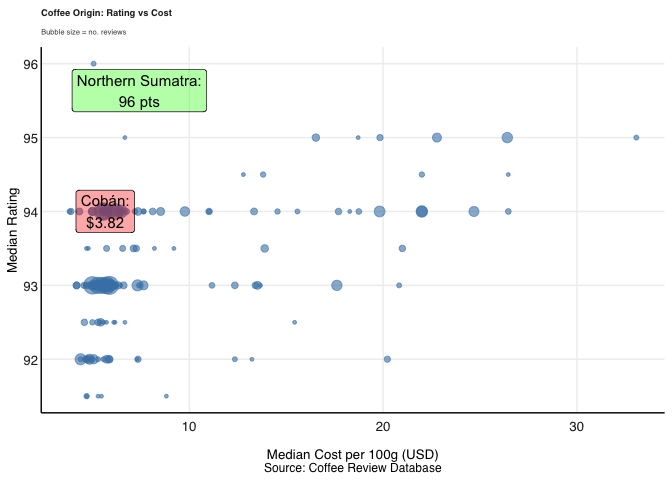

### Roast strength

A boxplot with individual reviews jittered on top shows both the typical
rating per roast and how much it varies. This is useful since a roast
could have a good median but huge spread.

Light and Medium-Light roasts consistently outscore Medium, Medium-Dark,
and especially Dark roasts.

    ## Warning in loadfonts_win(quiet = quiet): OS is not Windows. No fonts registered
    ## with windowsFonts().

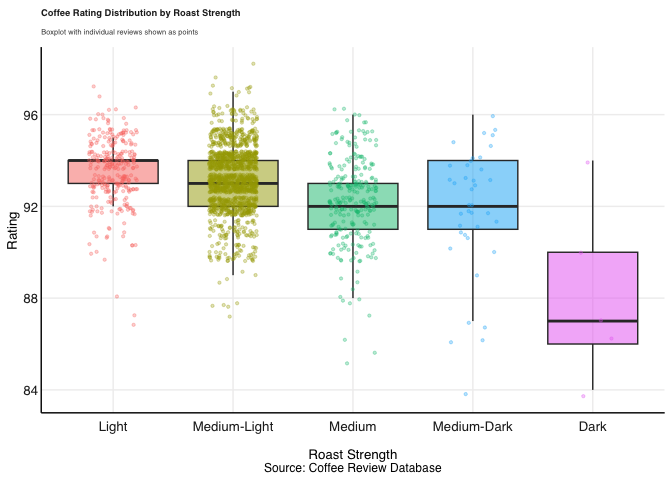

### Top suppliers

Ranked suppliers by rating directly, since that’s the simplest way to
answer “who should she buy from”. I filtered to a review-count minimum
so high ratings (with a low number of them) don’t dominate. I also added
a cost ceiling so the list stays realistic for a coffee shop in the
Neelsie (staff and student target audience) having to compete with
places like MyBrew which sell relatively cheap coffee.

Top-rated suppliers under $20/100g with at least 5 reviews each.

    ## Warning in loadfonts_win(quiet = quiet): OS is not Windows. No fonts registered
    ## with windowsFonts().

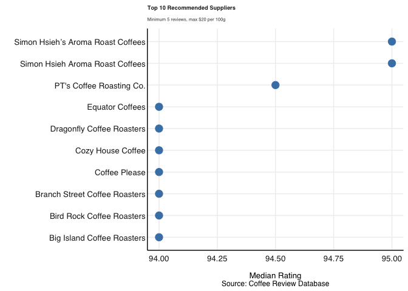

### Matching student preferences

The brief gave a wordcloud of words Stellenbosch students used to
describe coffee they liked. I picked the words that stood out most from
the wordcloud (chocolate, aroma, savory, toned, sweetly, tart) and used
grepl() to check which origins’ reviews mention them most frequently. I
filtered to origins with at least 20 reviews so one good review review
couldn’t skew the result, and plotted the top 10 as a share of total
reviews mentioning at least one of the keywords.

Reviews from Yemen, Tarrazu, and Boquete mention student-preferred
flavour words (chocolate, aroma, savory, toned, sweetly, tart) most
often.

    ## Warning in loadfonts_win(quiet = quiet): OS is not Windows. No fonts registered
    ## with windowsFonts().

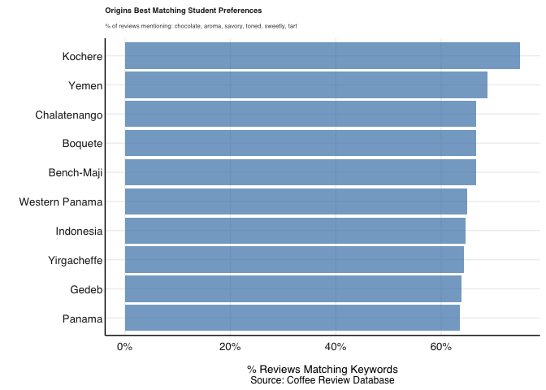

------------------------------------------------------------------------

# Question 2: Baby Names

## Approach

This question asked for the analysis of US baby naming trends
(1910-2014) for a toy design agency.The agency propositioned this in
order to understand what drives naming trends and how long they persist,
to inform toy character naming decisions.

# Naming Persistence Over Time

calc_rank_persistence() takes the top 25 names for a given year and sex,
then looks up each of those names in the full national ranking three
years later however far down they may have fallen. This is better than
comparing two top-25 lists directly (which was my initial appraoch),
because names that dropped out of the top 25 still get penalised rather
than being silently excluded. persistence_plot() then plots the
resulting Spearman correlation for every year from 1910 to 2011,
separately for boys and girls.


- Persistence dropped and became more volatile after 1990 (for both
  sexes)
- Girls’ names persistence started weakening earlier (mid-1950s/60s, not
  1990)
- Boys’ names persistence stayed stable until about 1990, then matched
  the same pattern
- Persistence is mostly weaker and more volatile since 1990 than in the
  early decades (for both sexes)

# Naming Surges and Cultural Events

The brief’s tip was to look for year-on-year surges and dig into what
might explain them, with Whitney in the 1980s given as the model
example. So I built find_name_surges() to find the biggest single-year
jumps in national popularity.

    ## # A tibble: 15 × 6
    ##    Name     Gender  Year Total  Prev Surge
    ##    <chr>    <chr>  <dbl> <dbl> <dbl> <dbl>
    ##  1 Linda    F       1947 99680 52708 46972
    ##  2 Shirley  F       1935 42357 22834 19523
    ##  3 Ashley   F       1983 33292 14848 18444
    ##  4 Robert   M       1946 84130 69926 14204
    ##  5 John     M       1946 79248 66123 13125
    ##  6 James    M       1946 87425 74450 12975
    ##  7 Deborah  F       1951 42043 29071 12972
    ##  8 Mary     F       1915 58187 45344 12843
    ##  9 Richard  M       1946 58859 46045 12814
    ## 10 Jennifer F       1970 46160 33705 12455
    ## 11 Amanda   F       1979 31926 20520 11406
    ## 12 David    M       1947 57797 46435 11362
    ## 13 Michael  M       1946 41178 29912 11266
    ## 14 Linda    F       1946 52708 41465 11243
    ## 15 John     M       1912 24587 13445 11142

- Several biggest male surges (Robert, John, James, Richard, Michael)
  all happen in 1946, suggesting a shared cause rather than separate
  ones
  - Likely the post-WWII baby boom, which raised total births that year
- Female surges (Linda, Shirley, Ashley) are more spread out, suggesting
  separate, name-specific causes
  - Shirley likely tracks child star Shirley Temple’s rise in the 1930s
  - Linda and Ashley probably follow similar celebrity-driven trends,
    though not individually verified

## More Recent Rising Names

To zoom into the most recent decade of data, I plotted the names with
the biggest average rise in popularity between 2005 and 2014, separately
for girls and boys, using my existing plot_rising_names() function.
Rather than just listing the names with a single surge year, this shows
their actual year-by-year counts as lines so it’s possible to see each
name rose, not just that it rose.

# More Recent Rising Names


- 2005 to 2014’s fastest-rising names (Sophia, Harper, Liam, Mason,
  etc.) show steady multi-year growth rather than a single sharp spike
- Daleyza stands out as a name with zero history before 2012, then
  immediate growth (a different pattern from names simply gaining
  popularity over time)
  - Interestingly, a quick google search attributes this rise in the
    name to the Mexican-American singer (Larry Hernandez) naming his
    daughter in 2010

One name in this list genuinely surprised me was **Daleyza**. I’d never
even heard this name before, and it doesn’t follow the same pattern as
most of the other surges on the list because there’s basically zero
history before it suddenly shows up, rather than slowly building up like
a normal “rising” name. That jump from nowhere is what had me running to
google and it turns out Mexican-American singer Larry Hernandez named
his daughter Daleyza in 2010, which seems to line up with the name
appearing out of nowhere shortly after. He also had a reality show
called LarryMania - the more you know…

This prompted me to check it out:

    ## # A tibble: 35 × 2
    ##    State Total
    ##    <chr> <dbl>
    ##  1 CA      505
    ##  2 TX      429
    ##  3 AZ      117
    ##  4 IL       90
    ##  5 CO       72
    ##  6 WA       68
    ##  7 NC       50
    ##  8 KS       42
    ##  9 GA       41
    ## 10 OR       41
    ## # ℹ 25 more rows

And suprise, suprise! Daleyza’s spike is heavily concentrated in
California and Texas, with Arizona, Illinois, and Colorado following
behind them. This matches the Larry Hernandez explanation because many
Mexican-Americans live in thse states (but they are also just some of
the most densely populated states in the U.S.)

## Conclusions

- Persistence has become less predictable since the 1960s, not
  specifically since 1990 as suspected by the agency.
  - Both boys’ and girls’ rankings show clear volatility decades before
    1990, so the 1990s aren’t a clean turning point, but the bigger
    instinct (that recent name trends are less stable than older ones)
    holds for the second half of the dataset.
- A practical implication for toy naming is that a name sitting in the
  top 25 today is a weaker guarantee of future popularity than it would
  have been pre-1960s so betting heavily on one trending name for a toy
  line carries more risk now than in earlier decades.
- Large naming surges have two driving forces, and they require
  different responses by the agency:
  - Population-wide events (e.g. the 1946 male-name cluster, likely tied
    to the post-WWII baby boom) lift already-popular names rather than
    creating new fashionable ones - not useful for spotting a “next big
    name,” since nothing new is actually trending
  - Culturally-driven, name-specific spikes (Shirley Temple, Whitney
    Houston and also likely Daleyza/Larry Hernandez) are the ones
    actually worth watching.
  - These show a single celebrity, character, or cultural moment can
    cause a name to gain popularity fast.
    - This is clearly the the driver that the agency should pay
      attention to for toy naming purposes
- The agency should also watch out for zero-history to sudden spike
  names like Daleyza as this could hint to a name suddenly gaining
  popularity.
- Overall, in recent years names have not been as persistent and so toy
  companies’ should maybe shy away from relying too much on such data.
- Caveat: this analysis focused on the baby-names data itself; a deeper
  dive cross-referencing HBO character names and Billboard artists/songs
  against naming spikes (as outlined in the brief) was not completed in
  this ietration due to time constraints

------------------------------------------------------------------------

# Question 3: Loans and Credit

## Approach

This question asked for an analysis of US household loan default trends
using anonymised Lending Club peer-to-peer lending data. The Director of
the Credit Institute in Texas wanted to understand what drives defaults
and whether four beliefs of the Institute hold up against the data.

    ## [1] 1000000     145

    ## Rows: 1,000,000
    ## Columns: 145
    ## $ id                                         <lgl> NA, NA, NA, NA, NA, NA, NA,…
    ## $ member_id                                  <lgl> NA, NA, NA, NA, NA, NA, NA,…
    ## $ loan_amnt                                  <dbl> 2500, 30000, 5000, 4000, 30…
    ## $ funded_amnt                                <dbl> 2500, 30000, 5000, 4000, 30…
    ## $ funded_amnt_inv                            <dbl> 2500, 30000, 5000, 4000, 30…
    ## $ term                                       <chr> "36 months", "60 months", "…
    ## $ int_rate                                   <dbl> 13.56, 18.94, 17.97, 18.94,…
    ## $ installment                                <dbl> 84.92, 777.23, 180.69, 146.…
    ## $ grade                                      <chr> "C", "D", "D", "D", "C", "C…
    ## $ sub_grade                                  <chr> "C1", "D2", "D1", "D2", "C4…
    ## $ emp_title                                  <chr> "Chef", "Postmaster", "Admi…
    ## $ emp_length                                 <chr> "10+ years", "10+ years", "…
    ## $ home_ownership                             <chr> "RENT", "MORTGAGE", "MORTGA…
    ## $ annual_inc                                 <dbl> 55000, 90000, 59280, 92000,…
    ## $ verification_status                        <chr> "Not Verified", "Source Ver…
    ## $ issue_d                                    <chr> "Dec-2018", "Dec-2018", "De…
    ## $ loan_status                                <chr> "Current", "Current", "Curr…
    ## $ pymnt_plan                                 <chr> "n", "n", "n", "n", "n", "n…
    ## $ url                                        <lgl> NA, NA, NA, NA, NA, NA, NA,…
    ## $ desc                                       <chr> NA, NA, NA, NA, NA, NA, NA,…
    ## $ purpose                                    <chr> "debt_consolidation", "debt…
    ## $ title                                      <chr> "Debt consolidation", "Debt…
    ## $ zip_code                                   <chr> "109xx", "713xx", "490xx", …
    ## $ addr_state                                 <chr> "NY", "LA", "MI", "WA", "MD…
    ## $ dti                                        <dbl> 18.24, 26.52, 10.51, 16.74,…
    ## $ delinq_2yrs                                <dbl> 0, 0, 0, 0, 0, 0, 0, 0, 0, …
    ## $ earliest_cr_line                           <chr> "Apr-2001", "Jun-1987", "Ap…
    ## $ inq_last_6mths                             <dbl> 1, 0, 0, 0, 0, 3, 1, 0, 1, …
    ## $ mths_since_last_delinq                     <dbl> NA, 71, NA, NA, NA, NA, NA,…
    ## $ mths_since_last_record                     <dbl> 45, 75, NA, NA, NA, NA, NA,…
    ## $ open_acc                                   <dbl> 9, 13, 8, 10, 12, 18, 1, 19…
    ## $ pub_rec                                    <dbl> 1, 1, 0, 0, 0, 0, 0, 0, 0, …
    ## $ revol_bal                                  <dbl> 4341, 12315, 4599, 5468, 82…
    ## $ revol_util                                 <dbl> 10.3, 24.2, 19.1, 78.1, 3.6…
    ## $ total_acc                                  <dbl> 34, 44, 13, 13, 26, 44, 9, …
    ## $ initial_list_status                        <chr> "w", "w", "w", "w", "w", "w…
    ## $ out_prncp                                  <dbl> 2386.02, 29387.75, 4787.21,…
    ## $ out_prncp_inv                              <dbl> 2386.02, 29387.75, 4787.21,…
    ## $ total_pymnt                                <dbl> 167.02, 1507.11, 353.89, 28…
    ## $ total_pymnt_inv                            <dbl> 167.02, 1507.11, 353.89, 28…
    ## $ total_rec_prncp                            <dbl> 113.98, 612.25, 212.79, 168…
    ## $ total_rec_int                              <dbl> 53.04, 894.86, 141.10, 118.…
    ## $ total_rec_late_fee                         <dbl> 0, 0, 0, 0, 0, 0, 0, 0, 0, …
    ## $ recoveries                                 <dbl> 0, 0, 0, 0, 0, 0, 0, 0, 0, …
    ## $ collection_recovery_fee                    <dbl> 0, 0, 0, 0, 0, 0, 0, 0, 0, …
    ## $ last_pymnt_d                               <chr> "Feb-2019", "Feb-2019", "Fe…
    ## $ last_pymnt_amnt                            <dbl> 84.92, 777.23, 180.69, 146.…
    ## $ next_pymnt_d                               <chr> "Mar-2019", "Mar-2019", "Ma…
    ## $ last_credit_pull_d                         <chr> "Feb-2019", "Feb-2019", "Fe…
    ## $ collections_12_mths_ex_med                 <dbl> 0, 0, 0, 0, 0, 0, 0, 0, 0, …
    ## $ mths_since_last_major_derog                <dbl> NA, NA, NA, NA, NA, NA, NA,…
    ## $ policy_code                                <dbl> 1, 1, 1, 1, 1, 1, 1, 1, 1, …
    ## $ application_type                           <chr> "Individual", "Individual",…
    ## $ annual_inc_joint                           <dbl> NA, NA, NA, NA, NA, NA, NA,…
    ## $ dti_joint                                  <dbl> NA, NA, NA, NA, NA, NA, NA,…
    ## $ verification_status_joint                  <chr> NA, NA, NA, NA, NA, NA, NA,…
    ## $ acc_now_delinq                             <dbl> 0, 0, 0, 0, 0, 0, 0, 0, 0, …
    ## $ tot_coll_amt                               <dbl> 0, 1208, 0, 686, 0, 0, 0, 0…
    ## $ tot_cur_bal                                <dbl> 16901, 321915, 110299, 3050…
    ## $ open_acc_6m                                <dbl> 2, 4, 0, 1, 3, 1, 0, 0, 5, …
    ## $ open_act_il                                <dbl> 2, 4, 1, 5, 5, 7, 0, 5, 2, …
    ## $ open_il_12m                                <dbl> 1, 2, 0, 3, 3, 2, 2, 0, 5, …
    ## $ open_il_24m                                <dbl> 2, 3, 2, 5, 5, 3, 3, 1, 5, …
    ## $ mths_since_rcnt_il                         <dbl> 2, 3, 14, 5, 4, 4, 7, 23, 3…
    ## $ total_bal_il                               <dbl> 12560, 87153, 7150, 30683, …
    ## $ il_util                                    <dbl> 69, 88, 72, 68, 89, 72, NA,…
    ## $ open_rv_12m                                <dbl> 2, 4, 0, 0, 2, 1, 0, 0, 1, …
    ## $ open_rv_24m                                <dbl> 7, 5, 2, 0, 4, 4, 1, 2, 6, …
    ## $ max_bal_bc                                 <dbl> 2137, 998, 0, 3761, 516, 17…
    ## $ all_util                                   <dbl> 28, 57, 35, 70, 54, 58, 100…
    ## $ total_rev_hi_lim                           <dbl> 42000, 50800, 24100, 7000, …
    ## $ inq_fi                                     <dbl> 1, 2, 1, 2, 1, 2, 0, 1, 2, …
    ## $ total_cu_tl                                <dbl> 11, 15, 5, 4, 0, 4, 0, 2, 1…
    ## $ inq_last_12m                               <dbl> 2, 2, 0, 3, 0, 6, 1, 0, 4, …
    ## $ acc_open_past_24mths                       <dbl> 9, 10, 4, 5, 9, 8, 4, 3, 12…
    ## $ avg_cur_bal                                <dbl> 1878, 24763, 18383, 30505, …
    ## $ bc_open_to_buy                             <dbl> 34360, 13761, 13800, 1239, …
    ## $ bc_util                                    <dbl> 5.9, 8.3, 0.0, 75.2, 8.9, 6…
    ## $ chargeoff_within_12_mths                   <dbl> 0, 0, 0, 0, 0, 0, 0, 0, 0, …
    ## $ delinq_amnt                                <dbl> 0, 0, 0, 0, 0, 0, 0, 0, 0, …
    ## $ mo_sin_old_il_acct                         <dbl> 140, 163, 87, 62, 53, 195, …
    ## $ mo_sin_old_rev_tl_op                       <dbl> 212, 378, 92, 154, 216, 176…
    ## $ mo_sin_rcnt_rev_tl_op                      <dbl> 1, 4, 15, 64, 2, 10, 23, 13…
    ## $ mo_sin_rcnt_tl                             <dbl> 1, 3, 14, 5, 2, 4, 7, 13, 3…
    ## $ mort_acc                                   <dbl> 0, 3, 2, 3, 2, 6, 0, 1, 3, …
    ## $ mths_since_recent_bc                       <dbl> 1, 4, 77, 64, 2, 20, NA, 14…
    ## $ mths_since_recent_bc_dlq                   <dbl> NA, NA, NA, NA, NA, NA, NA,…
    ## $ mths_since_recent_inq                      <dbl> 2, 4, 14, 5, 13, 3, 1, 13, …
    ## $ mths_since_recent_revol_delinq             <dbl> NA, NA, NA, NA, NA, NA, NA,…
    ## $ num_accts_ever_120_pd                      <dbl> 0, 0, 0, 0, 0, 0, 0, 0, 2, …
    ## $ num_actv_bc_tl                             <dbl> 2, 2, 0, 1, 2, 4, 0, 7, 4, …
    ## $ num_actv_rev_tl                            <dbl> 5, 4, 3, 2, 2, 6, 0, 12, 5,…
    ## $ num_bc_sats                                <dbl> 3, 4, 3, 1, 3, 6, 0, 8, 5, …
    ## $ num_bc_tl                                  <dbl> 3, 9, 3, 2, 8, 10, 3, 10, 1…
    ## $ num_il_tl                                  <dbl> 16, 27, 4, 7, 9, 23, 5, 15,…
    ## $ num_op_rev_tl                              <dbl> 7, 8, 6, 2, 6, 9, 0, 14, 6,…
    ## $ num_rev_accts                              <dbl> 18, 14, 7, 3, 15, 15, 3, 20…
    ## $ num_rev_tl_bal_gt_0                        <dbl> 5, 4, 3, 2, 2, 7, 0, 12, 5,…
    ## $ num_sats                                   <dbl> 9, 13, 8, 10, 12, 18, 1, 19…
    ## $ num_tl_120dpd_2m                           <dbl> 0, 0, 0, 0, 0, 0, 0, 0, 0, …
    ## $ num_tl_30dpd                               <dbl> 0, 0, 0, 0, 0, 0, 0, 0, 0, …
    ## $ num_tl_90g_dpd_24m                         <dbl> 0, 0, 0, 0, 0, 0, 0, 0, 0, …
    ## $ num_tl_op_past_12m                         <dbl> 3, 6, 0, 3, 5, 4, 2, 0, 6, …
    ## $ pct_tl_nvr_dlq                             <dbl> 100.0, 95.0, 100.0, 100.0, …
    ## $ percent_bc_gt_75                           <dbl> 0.0, 0.0, 0.0, 100.0, 0.0, …
    ## $ pub_rec_bankruptcies                       <dbl> 1, 1, 0, 0, 0, 0, 0, 0, 0, …
    ## $ tax_liens                                  <dbl> 0, 0, 0, 0, 0, 0, 0, 0, 0, …
    ## $ tot_hi_cred_lim                            <dbl> 60124, 372872, 136927, 3851…
    ## $ total_bal_ex_mort                          <dbl> 16901, 99468, 11749, 36151,…
    ## $ total_bc_limit                             <dbl> 36500, 15000, 13800, 5000, …
    ## $ total_il_high_credit_limit                 <dbl> 18124, 94072, 10000, 44984,…
    ## $ revol_bal_joint                            <dbl> NA, NA, NA, NA, NA, NA, NA,…
    ## $ sec_app_earliest_cr_line                   <chr> NA, NA, NA, NA, NA, NA, NA,…
    ## $ sec_app_inq_last_6mths                     <dbl> NA, NA, NA, NA, NA, NA, NA,…
    ## $ sec_app_mort_acc                           <dbl> NA, NA, NA, NA, NA, NA, NA,…
    ## $ sec_app_open_acc                           <dbl> NA, NA, NA, NA, NA, NA, NA,…
    ## $ sec_app_revol_util                         <dbl> NA, NA, NA, NA, NA, NA, NA,…
    ## $ sec_app_open_act_il                        <dbl> NA, NA, NA, NA, NA, NA, NA,…
    ## $ sec_app_num_rev_accts                      <dbl> NA, NA, NA, NA, NA, NA, NA,…
    ## $ sec_app_chargeoff_within_12_mths           <dbl> NA, NA, NA, NA, NA, NA, NA,…
    ## $ sec_app_collections_12_mths_ex_med         <dbl> NA, NA, NA, NA, NA, NA, NA,…
    ## $ sec_app_mths_since_last_major_derog        <dbl> NA, NA, NA, NA, NA, NA, NA,…
    ## $ hardship_flag                              <chr> "N", "N", "N", "N", "N", "N…
    ## $ hardship_type                              <chr> NA, NA, NA, NA, NA, NA, NA,…
    ## $ hardship_reason                            <chr> NA, NA, NA, NA, NA, NA, NA,…
    ## $ hardship_status                            <chr> NA, NA, NA, NA, NA, NA, NA,…
    ## $ deferral_term                              <dbl> NA, NA, NA, NA, NA, NA, NA,…
    ## $ hardship_amount                            <dbl> NA, NA, NA, NA, NA, NA, NA,…
    ## $ hardship_start_date                        <chr> NA, NA, NA, NA, NA, NA, NA,…
    ## $ hardship_end_date                          <chr> NA, NA, NA, NA, NA, NA, NA,…
    ## $ payment_plan_start_date                    <chr> NA, NA, NA, NA, NA, NA, NA,…
    ## $ hardship_length                            <dbl> NA, NA, NA, NA, NA, NA, NA,…
    ## $ hardship_dpd                               <dbl> NA, NA, NA, NA, NA, NA, NA,…
    ## $ hardship_loan_status                       <chr> NA, NA, NA, NA, NA, NA, NA,…
    ## $ orig_projected_additional_accrued_interest <dbl> NA, NA, NA, NA, NA, NA, NA,…
    ## $ hardship_payoff_balance_amount             <dbl> NA, NA, NA, NA, NA, NA, NA,…
    ## $ hardship_last_payment_amount               <dbl> NA, NA, NA, NA, NA, NA, NA,…
    ## $ disbursement_method                        <chr> "Cash", "Cash", "Cash", "Ca…
    ## $ debt_settlement_flag                       <chr> "N", "N", "N", "N", "N", "N…
    ## $ debt_settlement_flag_date                  <chr> NA, NA, NA, NA, NA, NA, NA,…
    ## $ settlement_status                          <chr> NA, NA, NA, NA, NA, NA, NA,…
    ## $ settlement_date                            <chr> NA, NA, NA, NA, NA, NA, NA,…
    ## $ settlement_amount                          <dbl> NA, NA, NA, NA, NA, NA, NA,…
    ## $ settlement_percentage                      <dbl> NA, NA, NA, NA, NA, NA, NA,…
    ## $ settlement_term                            <dbl> NA, NA, NA, NA, NA, NA, NA,…

    ##     id          member_id        loan_amnt      funded_amnt    funded_amnt_inv
    ##  Mode:logical   Mode:logical   Min.   : 1000   Min.   : 1000   Min.   :  725  
    ##  NA's:1000000   NA's:1000000   1st Qu.: 8000   1st Qu.: 8000   1st Qu.: 8000  
    ##                                Median :13000   Median :13000   Median :13000  
    ##                                Mean   :15395   Mean   :15395   Mean   :15390  
    ##                                3rd Qu.:20000   3rd Qu.:20000   3rd Qu.:20000  
    ##                                Max.   :40000   Max.   :40000   Max.   :40000  
    ##                                                                               
    ##      term              int_rate      installment         grade          
    ##  Length:1000000     Min.   : 5.31   Min.   :  14.77   Length:1000000    
    ##  Class :character   1st Qu.: 9.16   1st Qu.: 251.36   Class :character  
    ##  Mode  :character   Median :11.99   Median : 380.66   Mode  :character  
    ##                     Mean   :12.83   Mean   : 454.53                     
    ##                     3rd Qu.:15.49   3rd Qu.: 610.62                     
    ##                     Max.   :30.99   Max.   :1670.15                     
    ##                                                                         
    ##   sub_grade          emp_title          emp_length        home_ownership    
    ##  Length:1000000     Length:1000000     Length:1000000     Length:1000000    
    ##  Class :character   Class :character   Class :character   Class :character  
    ##  Mode  :character   Mode  :character   Mode  :character   Mode  :character  
    ##                                                                             
    ##                                                                             
    ##                                                                             
    ##                                                                             
    ##    annual_inc      verification_status   issue_d          loan_status       
    ##  Min.   :      0   Length:1000000      Length:1000000     Length:1000000    
    ##  1st Qu.:  47000   Class :character    Class :character   Class :character  
    ##  Median :  66000   Mode  :character    Mode  :character   Mode  :character  
    ##  Mean   :  79749                                                            
    ##  3rd Qu.:  95000                                                            
    ##  Max.   :9930475                                                            
    ##                                                                             
    ##   pymnt_plan          url              desc             purpose         
    ##  Length:1000000     Mode:logical   Length:1000000     Length:1000000    
    ##  Class :character   NA's:1000000   Class :character   Class :character  
    ##  Mode  :character                  Mode  :character   Mode  :character  
    ##                                                                         
    ##                                                                         
    ##                                                                         
    ##                                                                         
    ##     title             zip_code          addr_state             dti        
    ##  Length:1000000     Length:1000000     Length:1000000     Min.   : -1.00  
    ##  Class :character   Class :character   Class :character   1st Qu.: 11.91  
    ##  Mode  :character   Mode  :character   Mode  :character   Median : 18.02  
    ##                                                           Mean   : 19.30  
    ##                                                           3rd Qu.: 25.00  
    ##                                                           Max.   :999.00  
    ##                                                           NA's   :1197    
    ##   delinq_2yrs      earliest_cr_line   inq_last_6mths   mths_since_last_delinq
    ##  Min.   : 0.0000   Length:1000000     Min.   :0.0000   Min.   :  0.00        
    ##  1st Qu.: 0.0000   Class :character   1st Qu.:0.0000   1st Qu.: 17.00        
    ##  Median : 0.0000   Mode  :character   Median :0.0000   Median : 32.00        
    ##  Mean   : 0.2945                      Mean   :0.5051   Mean   : 35.12        
    ##  3rd Qu.: 0.0000                      3rd Qu.:1.0000   3rd Qu.: 51.00        
    ##  Max.   :58.0000                      Max.   :5.0000   Max.   :226.00        
    ##                                       NA's   :1        NA's   :515355        
    ##  mths_since_last_record    open_acc        pub_rec          revol_bal      
    ##  Min.   :  0.00         Min.   :  0.0   Min.   : 0.0000   Min.   :      0  
    ##  1st Qu.: 57.00         1st Qu.:  8.0   1st Qu.: 0.0000   1st Qu.:   5684  
    ##  Median : 76.00         Median : 11.0   Median : 0.0000   Median :  11069  
    ##  Mean   : 73.42         Mean   : 11.7   Mean   : 0.1948   Mean   :  16661  
    ##  3rd Qu.: 92.00         3rd Qu.: 15.0   3rd Qu.: 0.0000   3rd Qu.:  20057  
    ##  Max.   :127.00         Max.   :101.0   Max.   :86.0000   Max.   :2358150  
    ##  NA's   :841245                                                            
    ##    revol_util       total_acc      initial_list_status   out_prncp    
    ##  Min.   :  0.00   Min.   :  2.00   Length:1000000      Min.   :    0  
    ##  1st Qu.: 28.20   1st Qu.: 15.00   Class :character    1st Qu.:    0  
    ##  Median : 46.50   Median : 22.00   Mode  :character    Median : 3174  
    ##  Mean   : 47.42   Mean   : 23.64                       Mean   : 7095  
    ##  3rd Qu.: 66.10   3rd Qu.: 30.00                       3rd Qu.:11453  
    ##  Max.   :191.00   Max.   :176.00                       Max.   :40000  
    ##  NA's   :887                                                          
    ##  out_prncp_inv    total_pymnt    total_pymnt_inv total_rec_prncp
    ##  Min.   :    0   Min.   :    0   Min.   :    0   Min.   :    0  
    ##  1st Qu.:    0   1st Qu.: 2500   1st Qu.: 2499   1st Qu.: 1575  
    ##  Median : 3171   Median : 6045   Median : 6043   Median : 4300  
    ##  Mean   : 7093   Mean   : 9257   Mean   : 9254   Mean   : 7292  
    ##  3rd Qu.:11449   3rd Qu.:12947   3rd Qu.:12941   3rd Qu.:10000  
    ##  Max.   :40000   Max.   :59808   Max.   :59808   Max.   :40000  
    ##                                                                 
    ##  total_rec_int     total_rec_late_fee   recoveries      
    ##  Min.   :    0.0   Min.   :   0.000   Min.   :    0.00  
    ##  1st Qu.:  507.3   1st Qu.:   0.000   1st Qu.:    0.00  
    ##  Median : 1116.4   Median :   0.000   Median :    0.00  
    ##  Mean   : 1867.8   Mean   :   1.374   Mean   :   95.81  
    ##  3rd Qu.: 2352.7   3rd Qu.:   0.000   3rd Qu.:    0.00  
    ##  Max.   :24827.8   Max.   :1427.250   Max.   :37153.46  
    ##                                                         
    ##  collection_recovery_fee last_pymnt_d       last_pymnt_amnt  
    ##  Min.   :   0.00         Length:1000000     Min.   :    0.0  
    ##  1st Qu.:   0.00         Class :character   1st Qu.:  294.0  
    ##  Median :   0.00         Mode  :character   Median :  515.7  
    ##  Mean   :  16.81                            Mean   : 2759.7  
    ##  3rd Qu.:   0.00                            3rd Qu.: 1218.9  
    ##  Max.   :6687.62                            Max.   :42148.5  
    ##                                                              
    ##  next_pymnt_d       last_credit_pull_d collections_12_mths_ex_med
    ##  Length:1000000     Length:1000000     Min.   : 0.00000          
    ##  Class :character   Class :character   1st Qu.: 0.00000          
    ##  Mode  :character   Mode  :character   Median : 0.00000          
    ##                                        Mean   : 0.01975          
    ##                                        3rd Qu.: 0.00000          
    ##                                        Max.   :20.00000          
    ##                                                                  
    ##  mths_since_last_major_derog  policy_code application_type   annual_inc_joint 
    ##  Min.   :  0.00              Min.   :1    Length:1000000     Min.   :   5694  
    ##  1st Qu.: 28.00              1st Qu.:1    Class :character   1st Qu.:  84700  
    ##  Median : 45.00              Median :1    Mode  :character   Median : 112000  
    ##  Mean   : 45.11              Mean   :1                       Mean   : 126378  
    ##  3rd Qu.: 63.00              3rd Qu.:1                       3rd Qu.: 150000  
    ##  Max.   :226.00              Max.   :1                       Max.   :7874821  
    ##  NA's   :738819                                              NA's   :921866   
    ##    dti_joint      verification_status_joint acc_now_delinq    
    ##  Min.   : 0.00    Length:1000000            Min.   :0.000000  
    ##  1st Qu.:13.37    Class :character          1st Qu.:0.000000  
    ##  Median :18.78    Mode  :character          Median :0.000000  
    ##  Mean   :19.24                              Mean   :0.003365  
    ##  3rd Qu.:24.69                              3rd Qu.:0.000000  
    ##  Max.   :69.49                              Max.   :6.000000  
    ##  NA's   :921870                                               
    ##   tot_coll_amt        tot_cur_bal       open_acc_6m      open_act_il    
    ##  Min.   :      0.0   Min.   :      0   Min.   : 0.000   Min.   : 0.000  
    ##  1st Qu.:      0.0   1st Qu.:  28733   1st Qu.: 0.000   1st Qu.: 1.000  
    ##  Median :      0.0   Median :  78162   Median : 1.000   Median : 2.000  
    ##  Mean   :    242.4   Mean   : 143651   Mean   : 0.951   Mean   : 2.764  
    ##  3rd Qu.:      0.0   3rd Qu.: 215196   3rd Qu.: 1.000   3rd Qu.: 3.000  
    ##  Max.   :6214661.0   Max.   :9971659   Max.   :18.000   Max.   :56.000  
    ##                                        NA's   :49041    NA's   :49040   
    ##   open_il_12m      open_il_24m     mths_since_rcnt_il  total_bal_il    
    ##  Min.   : 0.000   Min.   : 0.000   Min.   :  0.00     Min.   :      0  
    ##  1st Qu.: 0.000   1st Qu.: 0.000   1st Qu.:  7.00     1st Qu.:   8636  
    ##  Median : 0.000   Median : 1.000   Median : 13.00     Median :  23106  
    ##  Mean   : 0.699   Mean   : 1.576   Mean   : 21.18     Mean   :  35466  
    ##  3rd Qu.: 1.000   3rd Qu.: 2.000   3rd Qu.: 24.00     3rd Qu.:  46105  
    ##  Max.   :25.000   Max.   :51.000   Max.   :511.00     Max.   :1837038  
    ##  NA's   :49040    NA's   :49040    NA's   :79709      NA's   :49040    
    ##     il_util         open_rv_12m      open_rv_24m       max_bal_bc     
    ##  Min.   :   0.00   Min.   : 0.000   Min.   : 0.000   Min.   :      0  
    ##  1st Qu.:  56.00   1st Qu.: 0.000   1st Qu.: 1.000   1st Qu.:   2274  
    ##  Median :  72.00   Median : 1.000   Median : 2.000   Median :   4412  
    ##  Mean   :  69.46   Mean   : 1.298   Mean   : 2.758   Mean   :   5822  
    ##  3rd Qu.:  86.00   3rd Qu.: 2.000   3rd Qu.: 4.000   3rd Qu.:   7624  
    ##  Max.   :1000.00   Max.   :28.000   Max.   :60.000   Max.   :1170668  
    ##  NA's   :189967    NA's   :49040    NA's   :49040    NA's   :49040    
    ##     all_util      total_rev_hi_lim      inq_fi        total_cu_tl     
    ##  Min.   :  0.00   Min.   :      0   Min.   : 0.000   Min.   :  0.000  
    ##  1st Qu.: 43.00   1st Qu.:  15200   1st Qu.: 0.000   1st Qu.:  0.000  
    ##  Median : 58.00   Median :  26700   Median : 1.000   Median :  0.000  
    ##  Mean   : 57.03   Mean   :  36231   Mean   : 1.028   Mean   :  1.491  
    ##  3rd Qu.: 72.00   3rd Qu.:  45500   3rd Qu.: 2.000   3rd Qu.:  2.000  
    ##  Max.   :239.00   Max.   :2087500   Max.   :48.000   Max.   :111.000  
    ##  NA's   :49192                      NA's   :49040    NA's   :49041    
    ##   inq_last_12m    acc_open_past_24mths  avg_cur_bal     bc_open_to_buy  
    ##  Min.   : 0.000   Min.   : 0.000       Min.   :     0   Min.   :     0  
    ##  1st Qu.: 0.000   1st Qu.: 2.000       1st Qu.:  3043   1st Qu.:  2154  
    ##  Median : 1.000   Median : 4.000       Median :  7227   Median :  6505  
    ##  Mean   : 2.047   Mean   : 4.606       Mean   : 13557   Mean   : 12773  
    ##  3rd Qu.: 3.000   3rd Qu.: 6.000       3rd Qu.: 18724   3rd Qu.: 16219  
    ##  Max.   :67.000   Max.   :64.000       Max.   :752994   Max.   :711140  
    ##  NA's   :49041                         NA's   :40       NA's   :11880   
    ##     bc_util       chargeoff_within_12_mths  delinq_amnt       
    ##  Min.   :  0.00   Min.   :0.000000         Min.   :     0.00  
    ##  1st Qu.: 31.10   1st Qu.:0.000000         1st Qu.:     0.00  
    ##  Median : 55.20   Median :0.000000         Median :     0.00  
    ##  Mean   : 54.45   Mean   :0.008081         Mean   :    12.71  
    ##  3rd Qu.: 79.80   3rd Qu.:0.000000         3rd Qu.:     0.00  
    ##  Max.   :201.90   Max.   :9.000000         Max.   :185408.00  
    ##  NA's   :12334                                                
    ##  mo_sin_old_il_acct mo_sin_old_rev_tl_op mo_sin_rcnt_rev_tl_op
    ##  Min.   :  0.0      Min.   :  1.0        Min.   :  0.00       
    ##  1st Qu.: 93.0      1st Qu.:114.0        1st Qu.:  4.00       
    ##  Median :130.0      Median :161.0        Median :  8.00       
    ##  Mean   :124.9      Mean   :179.4        Mean   : 14.25       
    ##  3rd Qu.:154.0      3rd Qu.:231.0        3rd Qu.: 18.00       
    ##  Max.   :848.0      Max.   :901.0        Max.   :502.00       
    ##  NA's   :31969                                                
    ##  mo_sin_rcnt_tl       mort_acc      mths_since_recent_bc
    ##  Min.   :  0.000   Min.   : 0.000   Min.   :  0.00      
    ##  1st Qu.:  3.000   1st Qu.: 0.000   1st Qu.:  6.00      
    ##  Median :  6.000   Median : 1.000   Median : 14.00      
    ##  Mean   :  8.287   Mean   : 1.454   Mean   : 24.81      
    ##  3rd Qu.: 11.000   3rd Qu.: 2.000   3rd Qu.: 29.00      
    ##  Max.   :382.000   Max.   :87.000   Max.   :661.00      
    ##                                     NA's   :11206       
    ##  mths_since_recent_bc_dlq mths_since_recent_inq mths_since_recent_revol_delinq
    ##  Min.   :  0.00           Min.   : 0.000        Min.   :  0.00                
    ##  1st Qu.: 21.00           1st Qu.: 2.000        1st Qu.: 18.00                
    ##  Median : 37.00           Median : 6.000        Median : 33.00                
    ##  Mean   : 39.37           Mean   : 7.125        Mean   : 36.14                
    ##  3rd Qu.: 57.00           3rd Qu.:11.000        3rd Qu.: 51.00                
    ##  Max.   :194.00           Max.   :25.000        Max.   :197.00                
    ##  NA's   :772743           NA's   :114169        NA's   :674386                
    ##  num_accts_ever_120_pd num_actv_bc_tl   num_actv_rev_tl   num_bc_sats    
    ##  Min.   : 0.0000       Min.   : 0.000   Min.   : 0.000   Min.   : 0.000  
    ##  1st Qu.: 0.0000       1st Qu.: 2.000   1st Qu.: 3.000   1st Qu.: 3.000  
    ##  Median : 0.0000       Median : 3.000   Median : 5.000   Median : 4.000  
    ##  Mean   : 0.5079       Mean   : 3.655   Mean   : 5.543   Mean   : 4.813  
    ##  3rd Qu.: 0.0000       3rd Qu.: 5.000   3rd Qu.: 7.000   3rd Qu.: 6.000  
    ##  Max.   :58.0000       Max.   :50.000   Max.   :72.000   Max.   :71.000  
    ##                                                                          
    ##    num_bc_tl        num_il_tl       num_op_rev_tl    num_rev_accts   
    ##  Min.   : 0.000   Min.   :  0.000   Min.   : 0.000   Min.   :  2.00  
    ##  1st Qu.: 4.000   1st Qu.:  3.000   1st Qu.: 5.000   1st Qu.:  8.00  
    ##  Median : 6.000   Median :  6.000   Median : 7.000   Median : 12.00  
    ##  Mean   : 7.389   Mean   :  8.416   Mean   : 8.249   Mean   : 13.54  
    ##  3rd Qu.:10.000   3rd Qu.: 11.000   3rd Qu.:11.000   3rd Qu.: 17.00  
    ##  Max.   :86.000   Max.   :159.000   Max.   :91.000   Max.   :151.00  
    ##                                                                      
    ##  num_rev_tl_bal_gt_0    num_sats      num_tl_120dpd_2m  num_tl_30dpd     
    ##  Min.   : 0.000      Min.   :  0.00   Min.   :0        Min.   :0.000000  
    ##  1st Qu.: 3.000      1st Qu.:  8.00   1st Qu.:0        1st Qu.:0.000000  
    ##  Median : 5.000      Median : 11.00   Median :0        Median :0.000000  
    ##  Mean   : 5.496      Mean   : 11.66   Mean   :0        Mean   :0.002252  
    ##  3rd Qu.: 7.000      3rd Qu.: 15.00   3rd Qu.:0        3rd Qu.:0.000000  
    ##  Max.   :65.000      Max.   :101.00   Max.   :4        Max.   :4.000000  
    ##                                       NA's   :37610                      
    ##  num_tl_90g_dpd_24m num_tl_op_past_12m pct_tl_nvr_dlq   percent_bc_gt_75
    ##  Min.   : 0.00000   Min.   : 0.000     Min.   :  0.00   Min.   :  0.00  
    ##  1st Qu.: 0.00000   1st Qu.: 1.000     1st Qu.: 91.30   1st Qu.:  0.00  
    ##  Median : 0.00000   Median : 2.000     Median :100.00   Median : 33.30  
    ##  Mean   : 0.07763   Mean   : 2.129     Mean   : 94.11   Mean   : 38.22  
    ##  3rd Qu.: 0.00000   3rd Qu.: 3.000     3rd Qu.:100.00   3rd Qu.: 66.70  
    ##  Max.   :58.00000   Max.   :32.000     Max.   :100.00   Max.   :100.00  
    ##                                        NA's   :2        NA's   :11973   
    ##  pub_rec_bankruptcies   tax_liens        tot_hi_cred_lim   total_bal_ex_mort
    ##  Min.   :0.0000       Min.   : 0.00000   Min.   :      0   Min.   :      0  
    ##  1st Qu.:0.0000       1st Qu.: 0.00000   1st Qu.:  51905   1st Qu.:  20847  
    ##  Median :0.0000       Median : 0.00000   Median : 115700   Median :  38530  
    ##  Mean   :0.1326       Mean   : 0.04212   Mean   : 181752   Mean   :  52295  
    ##  3rd Qu.:0.0000       3rd Qu.: 0.00000   3rd Qu.: 262707   3rd Qu.:  66335  
    ##  Max.   :9.0000       Max.   :85.00000   Max.   :9999999   Max.   :2622906  
    ##                                                                             
    ##  total_bc_limit    total_il_high_credit_limit revol_bal_joint  
    ##  Min.   :      0   Min.   :      0            Min.   :      0  
    ##  1st Qu.:   8800   1st Qu.:  15436            1st Qu.:  15477  
    ##  Median :  17300   Median :  33975            Median :  27350  
    ##  Mean   :  24509   Mean   :  45413            Mean   :  34757  
    ##  3rd Qu.:  32100   3rd Qu.:  61128            3rd Qu.:  45215  
    ##  Max.   :1569000   Max.   :2118996            Max.   :1110019  
    ##                                               NA's   :931015   
    ##  sec_app_earliest_cr_line sec_app_inq_last_6mths sec_app_mort_acc
    ##  Length:1000000           Min.   :0.00           Min.   : 0.00   
    ##  Class :character         1st Qu.:0.00           1st Qu.: 0.00   
    ##  Mode  :character         Median :0.00           Median : 1.00   
    ##                           Mean   :0.61           Mean   : 1.54   
    ##                           3rd Qu.:1.00           3rd Qu.: 2.00   
    ##                           Max.   :6.00           Max.   :27.00   
    ##                           NA's   :931015         NA's   :931015  
    ##  sec_app_open_acc sec_app_revol_util sec_app_open_act_il sec_app_num_rev_accts
    ##  Min.   : 0.00    Min.   :  0.00     Min.   : 0          Min.   :  0.00       
    ##  1st Qu.: 7.00    1st Qu.: 38.30     1st Qu.: 1          1st Qu.:  7.00       
    ##  Median :10.00    Median : 59.10     Median : 2          Median : 11.00       
    ##  Mean   :11.49    Mean   : 57.11     Mean   : 3          Mean   : 12.52       
    ##  3rd Qu.:15.00    3rd Qu.: 77.80     3rd Qu.: 4          3rd Qu.: 17.00       
    ##  Max.   :67.00    Max.   :434.30     Max.   :43          Max.   :106.00       
    ##  NA's   :931015   NA's   :932212     NA's   :931015      NA's   :931015       
    ##  sec_app_chargeoff_within_12_mths sec_app_collections_12_mths_ex_med
    ##  Min.   : 0.00                    Min.   : 0.00                     
    ##  1st Qu.: 0.00                    1st Qu.: 0.00                     
    ##  Median : 0.00                    Median : 0.00                     
    ##  Mean   : 0.04                    Mean   : 0.07                     
    ##  3rd Qu.: 0.00                    3rd Qu.: 0.00                     
    ##  Max.   :21.00                    Max.   :23.00                     
    ##  NA's   :931015                   NA's   :931015                    
    ##  sec_app_mths_since_last_major_derog hardship_flag      hardship_type     
    ##  Min.   :  0.00                      Length:1000000     Length:1000000    
    ##  1st Qu.: 17.00                      Class :character   Class :character  
    ##  Median : 36.00                      Mode  :character   Mode  :character  
    ##  Mean   : 37.33                                                           
    ##  3rd Qu.: 57.00                                                           
    ##  Max.   :185.00                                                           
    ##  NA's   :977623                                                           
    ##  hardship_reason    hardship_status    deferral_term    hardship_amount 
    ##  Length:1000000     Length:1000000     Min.   :3        Min.   :  0.64  
    ##  Class :character   Class :character   1st Qu.:3        1st Qu.: 58.91  
    ##  Mode  :character   Mode  :character   Median :3        Median :116.26  
    ##                                        Mean   :3        Mean   :153.44  
    ##                                        3rd Qu.:3        3rd Qu.:212.35  
    ##                                        Max.   :3        Max.   :845.22  
    ##                                        NA's   :994725   NA's   :994725  
    ##  hardship_start_date hardship_end_date  payment_plan_start_date
    ##  Length:1000000      Length:1000000     Length:1000000         
    ##  Class :character    Class :character   Class :character       
    ##  Mode  :character    Mode  :character   Mode  :character       
    ##                                                                
    ##                                                                
    ##                                                                
    ##                                                                
    ##  hardship_length   hardship_dpd    hardship_loan_status
    ##  Min.   :3        Min.   : 0.00    Length:1000000      
    ##  1st Qu.:3        1st Qu.: 4.50    Class :character    
    ##  Median :3        Median :15.00    Mode  :character    
    ##  Mean   :3        Mean   :13.66                        
    ##  3rd Qu.:3        3rd Qu.:22.00                        
    ##  Max.   :3        Max.   :37.00                        
    ##  NA's   :994725   NA's   :994725                       
    ##  orig_projected_additional_accrued_interest hardship_payoff_balance_amount
    ##  Min.   :   1.92                            Min.   :   55.73              
    ##  1st Qu.: 174.00                            1st Qu.: 5714.90              
    ##  Median : 343.18                            Median :10176.49              
    ##  Mean   : 449.46                            Mean   :11585.48              
    ##  3rd Qu.: 612.90                            3rd Qu.:16094.73              
    ##  Max.   :2535.66                            Max.   :40149.35              
    ##  NA's   :995892                             NA's   :994725                
    ##  hardship_last_payment_amount disbursement_method debt_settlement_flag
    ##  Min.   :   0.01              Length:1000000      Length:1000000      
    ##  1st Qu.:  40.85              Class :character    Class :character    
    ##  Median : 121.32              Mode  :character    Mode  :character    
    ##  Mean   : 185.23                                                      
    ##  3rd Qu.: 269.53                                                      
    ##  Max.   :1407.86                                                      
    ##  NA's   :994725                                                       
    ##  debt_settlement_flag_date settlement_status  settlement_date   
    ##  Length:1000000            Length:1000000     Length:1000000    
    ##  Class :character          Class :character   Class :character  
    ##  Mode  :character          Mode  :character   Mode  :character  
    ##                                                                 
    ##                                                                 
    ##                                                                 
    ##                                                                 
    ##  settlement_amount settlement_percentage settlement_term 
    ##  Min.   :  195     Min.   : 0.65         Min.   : 0.00   
    ##  1st Qu.: 2234     1st Qu.:45.00         1st Qu.:10.00   
    ##  Median : 4270     Median :45.00         Median :16.00   
    ##  Mean   : 5153     Mean   :47.90         Mean   :14.76   
    ##  3rd Qu.: 7134     3rd Qu.:50.00         3rd Qu.:18.00   
    ##  Max.   :28503     Max.   :95.05         Max.   :65.00   
    ##  NA's   :986581    NA's   :986581        NA's   :986581

The data has 1 million rows and 145 columns, so the first thing I did
was reduce it to only the columns actually needed for analysis. I then
built a clean_loans() function to create the outcome variables, convert
text columns to numeric, and Winsorise relevant (ie. variables with
crazy values as seen from the summary function) continuous variables at
the 1st and 99th percentiles. Since there is no age variable in the
dataset, I used credit history length derived from earliest_cr_line as a
proxy since I thought that a longer history likely means an older
borrower.

# Key Risk Drivers

The dataset contains many variables that could serve as default risk
drivers (revolving credit utilisation (revol_util), number of public
records (pub_rec), debt-to-incomeratio (dti), income verification status
(verification_status), and annual income (annual_inc) are all standard
credit risk indicators a lender would most likely consider. However, I
focused on credit grade and loan purpose because they are the most
immediately interpretable at a glance as a director looking at a bar
chart of default rates by grade or by loan purpose can draw actionable
conclusions without needing to understand the underlying variable in
detail.

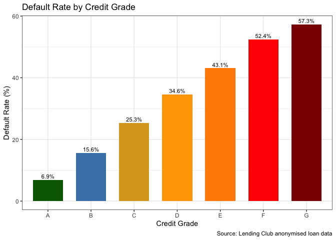

The plot shows a clear strong relationship between credit grade and
default rate (as expected).

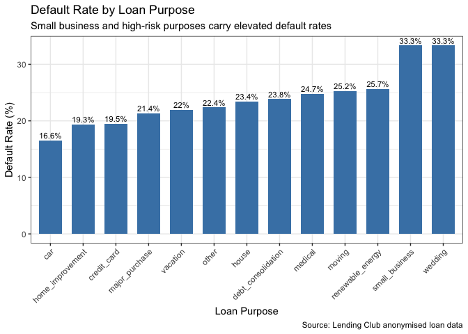

Car and home improvement loans carry the lowest default rates at around,
while small business and wedding loans sit at the top at. Thus, lenders
should apply greater scrutiny to higher-risk purpose categories when
assessing borrower credibility. This plot provides evidence that loan
purpose is a a good credit risk signal.

# Looking at the Beliefs held by the Institute

The Director wishes to challenge four core beliefs held by the Institute
so I tested each one using the cleaned data, building a separate plot
for each belief.

The first belief was that homeowners and people employed for more than
10 years default far less on short-term loans. To test this I built a
line plot showing default rates across home ownership categories, with
separate lines for borrowers employed 10+ years vs under 10 years,
filtering to short-term loans only since the belief is specifically
about those. The data contains only two loan terms (36 and 60 months) so
36 months is used as the short-term definition.

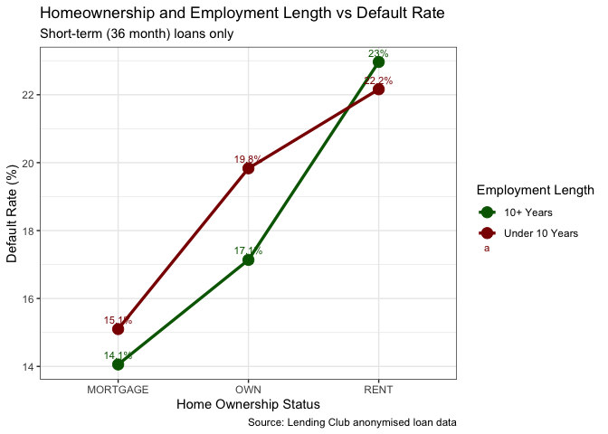

The plot somewhat confirms this belief since borrowers employed for 10
or more years show slightly lower default rates (lower by 1). This
difference is really small so this belief is only partly supported by
the data. On the other hand, homeowners (those with over and under 10
years of employment) have higher default rates than borrowers.

The second belief was that US states differ significantly in their
culture of defaulting. To test this I plotted default rates for every
state ordered from lowest to highest, with Texas highlighted separately
so it is easy to see where it sits relative to the rest.

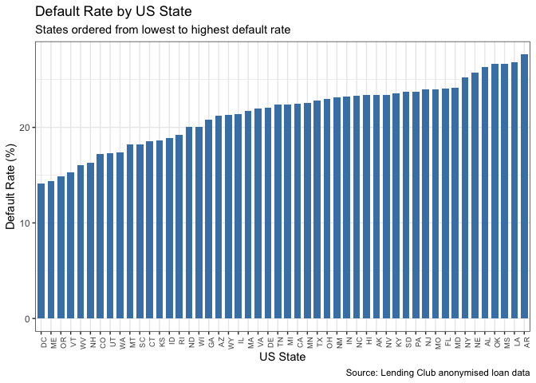

This belief is more closely supported by the data because default rates
range from around 14 to about 27. This means that US states do in fact
differ significantly in default culture. Texas sits close to the average
when looking at the bigger picture.

The third belief was that credit grades predict default well
specifically for younger individuals. Since there is no age variable in
the data I used credit history length as a proxy since shorter history
likely means a younger borrower. I then plotted default rates by grade
for each history group using facet_wrap, which creates one panel per
group so the grade pattern can be compared side by side.

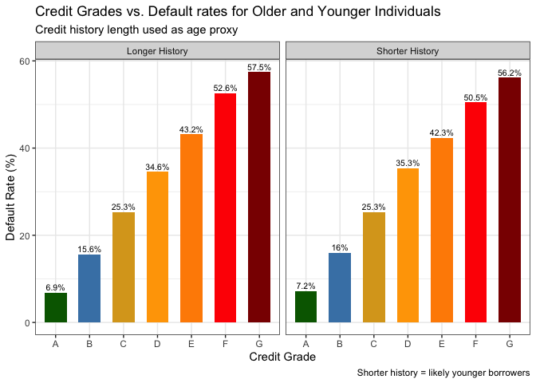

The credit grading system has the same relationship as before for both
younger (shorter credit history) and older (longer credit history)
individuals. This relationship is that default rates increase with lower
credit grades. The differences between older and younger individuals
default rates’ is very small. For higher grades, younger individuals
have a slightly higher default rating while for higher grades it is the
opposite. Thus, there is no evidence from the data to support the belief
that grades work better or worse for younger borrowers specifically.

The fourth belief was that interest rates are determined by age,
occupation and credit scores. Due to time constraints, I focused on
credit grade as a proxy for credit score and plotted the median interest
rate per grade. I will come back to this if I have the time - possible
to plot age (as proxied by credit history) against median interest
rates.

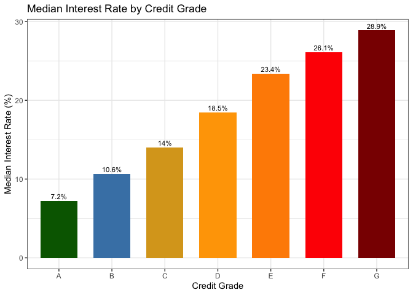

I wanted to use the credit history length as a proxy for age here again,
but I got stuck and am cautious of the time. I will return to this if I
have time left.

From this graph it is obvious that credit rating is an obvious
determinant of interest rates. From the basic understanding of interest
rates and credit ratings, this correlation makes sense, because a lower
credit rating means there is a higher risk of default. Thus, the risk is
compensated for by a higher interest rate (compared to higher credit
ratings). The dataset does not have any specific age or occupation data
so it would be difficult to draw conculsions about those factors.

## A note on knitting

## I unfortunately spent too long tweaking the Texevier YAML template for Question 3 and broke it (sorry) in the process. I get a `\pandocbounded` LaTeX error which I will torubleshoot if I have time. The analysis and all functions run correctly in RStudio, the PDF just would not compile in time. The full write-up lives in `Question3/Question3.Rmd` if needed.

# Question 4: Netflix

## Data Loading and Setup

The data comes from three sources where titles.rds contains scores,
genres, production countries, and runtime for all Netflix titles.
credits.rds links actors and directors to titles via a shared id column.
Netflix_movies.csv contains additional movie-level metadata including
country, age rating, and genre categories. I used the glimpse() function
as before to see what I was working with before approaching the data
cleaning.

Since all figures rely on titles and credits, the cleaning focuses on
those two. For titles, I filtered to movies only, removed entries with
missing or zero runtimes, and used gsub() to strip the brackets and
quotes from the genres and production_countries columns so they read as
plain comma-separated text. For credits I simply filtered to actors only
as this is what will be useful for my plots later on.

## Genre Preferences by Country

To identify what types of movies (genre) different countries produce, I
used grepl() to see genre membership per title and map_dfr() to stack
results into a long dataframe. The top 10 countries by movie count were
selected via count() and slice_head(), with each movie assigned to its
primary production country for faceting purposes.

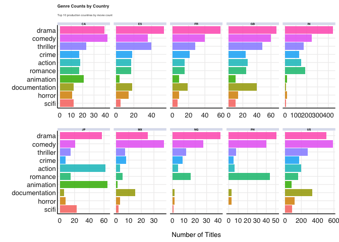

Drama and comedy seem to be the most popular genre for most countries,
but there are definitely differences between countries that are worth
noting. For example, Japan stands out for its unusually high share of
animation, while India, Nigeria and the Philippines have a high
preference for drama and romance with little prefernce for science
fiction or documentation content. Thus, content strategy should not be
applied at a global level, but rather tailored to the tastes of
individual countries.

## Audience Ratings by Genre

To understand what content audiences rate most highly, I computed the
median IMDb score per genre using the same grepl() and map_dfr() pattern
as before. Note that IMDb scores are global and not Netflix-specific so
they should be read as a general quality signal rather than a platform
performance measure.

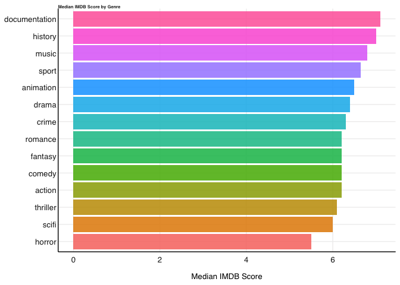

History and documentary content have the highest median scores, which
suggests that focusing on such niche content could be unique selling
point for a new streaming platform.

## Audience Engagement by Country

TMDb popularity scores reflect active audience engagement (that being
things like searches, watchlists, and rating activity)making them a
better proxy for streaming performance than critic scores alone. Given
heavy right skew in the distribution (median of about 6, max of about
1823), a log scale was applied in finplot(log.y = TRUE).I noticed this
after first plotting without the log scale and the results looking not
so nice.

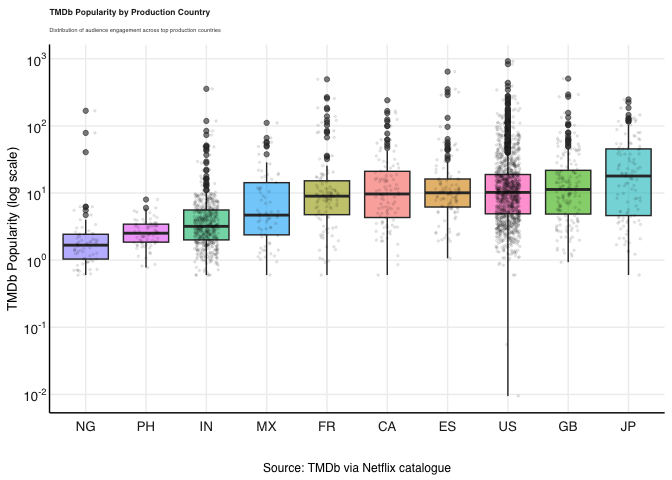

Japanese and English-language content (GB, US) drives the highest median
engagement globally, while Nigerian and Filipino content (while still
relatively popular) remains more locally concentrated.

## Movie Runtime by Country

I compared runtime distributions across the top 10 production countries
using a boxplot with jitter overlay, to address the brief’s requirement
of looking at the runtimes. Each movie is assigned to its primary
(first-listed) production country for grouping purposes. This is a
deliberate simplification documented here as co-productions are counted
under their lead country only. The fct_reorder() function orders
countries by median runtime so the plot reads cleanly from shortest to
longest.

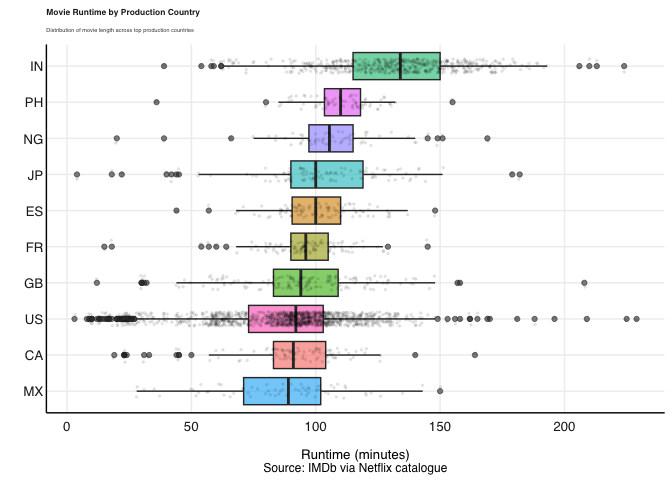

Indian cinema has the longest median runtime by a clear margin, which
matches what we know about the famously long format of Bollywood films.
The US has the widest spread reflecting its greatly varied runtimes. A
sweetspot is revealed though this data as the other countries seemingly
cluster around the 90-110 minute mark. This sweetspot should be taken
into account when choosing content for the new streaming platform.

## Does Star Power Drive Audience Engagement?

When I read the question for the first time, my curiosity was definitely
piqued and I immediately knew I wanted to do something with either the
actors or directors in the datasets. I landed on exploring whether
featuring well-known actors influences audience engagement because I saw
this as a practically relevant question for a streaming platform
deciding where to allocate its content budget. I defined “star power” as
any movie featuring at least one of the top 50 actors ranked by total
IMDb votes across their filmography. I identified them through an
inner_join() between actors_clean and titles_clean on the shared id
column. TMDb popularity was chosen as the outcome variable over IMDb
score because it reflects active audience engagement (searches,
watchlists, rating activity) rather than critical opinion. A log scale
was applied, finplot(log.y = TRUE), for the same reason as earlier.

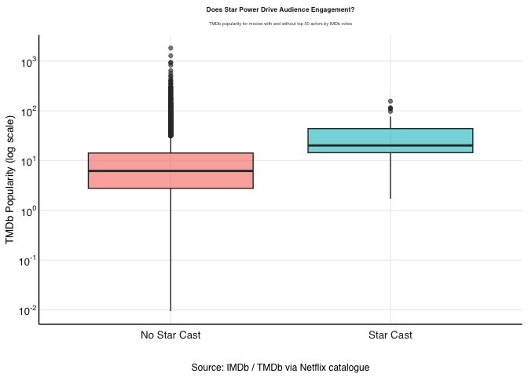

Star cast movies show have a visibly higher median TMDb popularity than
non-star cast movies. Thus, it suggests that casting recognisable names
will drive audience engagement on any new streaming platform.

## Conclusions

- Drama and comedy are safe bets globally, but content strategy should
  be tailored for each region eg. animation drives huge engagement in
  Japan.
- History and documentary genres score highest with audiences despite
  low production volumes so promoting such titles might give a platform
  a competitive advantage.
- English-language (GB) and Japanese content gets the highest TMDb
  engagement scores, these languages should be considered when making
  global content decisions.
- Most markets cluster around a 90–110 minute runtime sweet spot so
  acquiring content within this window will be beneficial in keeping
  audiences engaged (across all regions).
- Movies featuring top IMDb-voted actors show measurably higher audience
  engagement, suggesting that investing in recognisable talent is a
  worthwhile strategy for building an initial subscriber base.

------------------------------------------------------------------------
