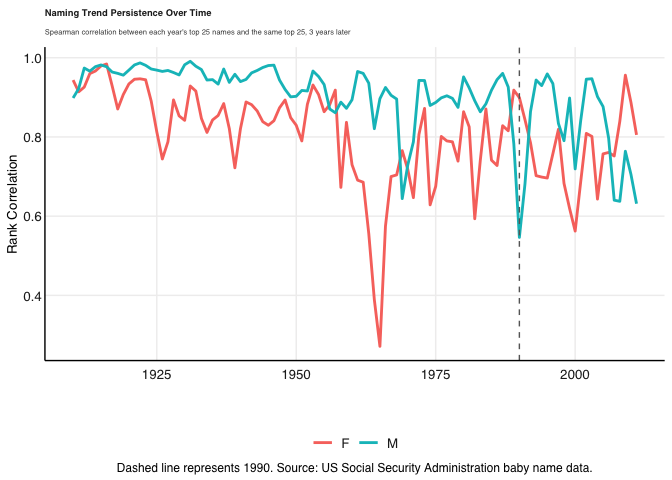

# Purpose

This folder contains my solutions to the Data Science for Economics and
Finance Practical Exam. Each question is contained in its own subfolder,
with functions stored in the respective `code/` folders and data stored
in the respective `data/` folders (gitignored).

------------------------------------------------------------------------

# Question 1: Coffee Hub

## Approach

A coffee entrepreneur wants to know which origin, roast strength, and
supplier to stock for a new shop, and how that lines up with what
Stellenbosch students say they like in their coffee.

I approached this by building one function per plot, namely origin vs
cost, roast strength, top suppliers, and a keyword-match check against
the student survey wordcloud. I cleaned the data first (checked for
missing values and tidied a few wide-format columns into long form),
then built each plot to answer one specific part of the brief rather
than trying to cram everything into a single chart.

``` r
library(tidyverse)
```

    ## ── Attaching core tidyverse packages ──────────────────────── tidyverse 2.0.0 ──
    ## ✔ dplyr     1.2.1     ✔ readr     2.2.0
    ## ✔ forcats   1.0.1     ✔ stringr   1.6.0
    ## ✔ ggplot2   4.0.3     ✔ tibble    3.3.1
    ## ✔ lubridate 1.9.5     ✔ tidyr     1.3.2
    ## ✔ purrr     1.2.2     
    ## ── Conflicts ────────────────────────────────────────── tidyverse_conflicts() ──
    ## ✖ dplyr::filter() masks stats::filter()
    ## ✖ dplyr::lag()    masks stats::lag()
    ## ℹ Use the conflicted package (<http://conflicted.r-lib.org/>) to force all conflicts to become errors

``` r
list.files('Question1/code/', full.names = T, recursive = T) %>%
    .[grepl('.R', .)] %>%
    as.list() %>%
    walk(~source(.))

Coffee <- silent_read(path = "Question1/data/Coffee/Coffee.csv")
```

### Data prep

Checked for missing values and a few messy duplicate names (e.g. roaster
names with curly vs straight apostrophes) before tidying
`origin_1`/`origin_2` and `desc_1`/`desc_2`/`desc_3` from wide to long
format, since each is really one variable spread across multiple
columns.

``` r
# Check for missing values/NA's
Coffee %>% summarise(across(everything(), ~sum(is.na(.))))
```

    ## # A tibble: 1 × 12
    ##    name roaster roast loc_country origin_1 origin_2 Cost_Per_100g Rating
    ##   <int>   <int> <int>       <int>    <int>    <int>         <int>  <int>
    ## 1     0       0    15           0        0        0             0      0
    ## # ℹ 4 more variables: review_date <int>, desc_1 <int>, desc_2 <int>,
    ## #   desc_3 <int>

``` r
Coffee_long <- Coffee %>%
    gather(origin_rank, origin, origin_1, origin_2) %>%
    gather(desc_rank, desc, desc_1, desc_2, desc_3) %>%
    filter(!is.na(desc))  # two coffees are missing a third review so those rows are dropped

# Chiriquí was splitting into 2 rows under different spellings, messing up the "best rated" label - fixed here so it applies to all the origin plots
Coffee_long <- Coffee_long %>%
    mutate(origin = gsub(" Growing Region| Growing District| District| Department| County| Province| Zone| Region", "", origin)) %>%
    mutate(origin = gsub("í", "i", origin))
```

### Origin vs cost

I plotted cost against rating to see if price actually tracks quality —
bubble size shows review count, so a region’s position isn’t trusted
equally regardless of how many reviews back it up.

Northern Sumatra is both the highest-rated origin and inexpensive, while
Cobán shows a well-rated coffee can be found for under $4 — high rating
doesn’t require a high price here.

``` r
g <- origin_cost_scatter(Coffee_long)
```

    ## Warning: The `<scale>` argument of `guides()` cannot be `FALSE`. Use "none" instead as
    ## of ggplot2 3.3.4.
    ## This warning is displayed once per session.
    ## Call `lifecycle::last_lifecycle_warnings()` to see where this warning was
    ## generated.

    ## Warning in loadfonts_win(quiet = quiet): OS is not Windows. No fonts registered
    ## with windowsFonts().

    ## Warning: The `size` argument of `element_rect()` is deprecated as of ggplot2 3.4.0.
    ## ℹ Please use the `linewidth` argument instead.
    ## ℹ The deprecated feature was likely used in the fmxdat package.
    ##   Please report the issue at <https://github.com/nicktz/fmxdat/issues>.
    ## This warning is displayed once per session.
    ## Call `lifecycle::last_lifecycle_warnings()` to see where this warning was
    ## generated.

    ## Warning: The `size` argument of `element_line()` is deprecated as of ggplot2 3.4.0.
    ## ℹ Please use the `linewidth` argument instead.
    ## ℹ The deprecated feature was likely used in the fmxdat package.
    ##   Please report the issue at <https://github.com/nicktz/fmxdat/issues>.
    ## This warning is displayed once per session.
    ## Call `lifecycle::last_lifecycle_warnings()` to see where this warning was
    ## generated.

``` r
g
```


### Roast strength

A boxplot with individual reviews jittered on top shows both the typical
rating per roast and how much it varies. This is useful since a roast
could have a good median but huge spread.

Light and Medium-Light roasts consistently outscore Medium, Medium-Dark,
and especially Dark roasts.

``` r
g <- roast_plot(Coffee)
```

    ## Warning in loadfonts_win(quiet = quiet): OS is not Windows. No fonts registered
    ## with windowsFonts().

``` r
g
```


### Top suppliers

Ranked suppliers by rating directly, since that’s the simplest way to
answer “who should she buy from”. I filtered to a review-count minimum
so high ratings (with a low number of them) don’t dominate, and a cost
ceiling so the list stays realistic for a student-shop having to compete
with places like MyVrew which sell relatively cheap coffee.

Top-rated suppliers under $20/100g with at least 5 reviews each.

``` r
g <- supplier_plot(Coffee)
```

    ## Warning in loadfonts_win(quiet = quiet): OS is not Windows. No fonts registered
    ## with windowsFonts().

``` r
g
```


### Matching student preferences

The brief gave a wordcloud of words Stellenbosch students used to
describe coffee they liked. I picked the words that stood out most and
checked which origins’ reviews mention them the most.

Reviews from Yemen, Tarrazu, and Boquete mention student-preferred
flavour words (chocolate, aroma, savory, toned, sweetly, tart) most
often.

``` r
g <- keyword_plot(Coffee_long)
```

    ## Warning in loadfonts_win(quiet = quiet): OS is not Windows. No fonts registered
    ## with windowsFonts().

``` r
g
```


------------------------------------------------------------------------

# Question 2: Baby Names

## Approach

I approached this by first building the required Spearman
rank-correlation time series (comparing each year’s top 25 names to the
same top 25 three years later), then separately looking at year-on-year
naming surges and checking a few against Billboard and HBO data for a
plausible cultural cause.

# Naming Persistence Over Time

For each year, I took the top 25 boys’ and girls’ names nationally
(summed across states), and compared that ranking to the top 25 from the
same sex three years later using Spearman rank correlation (only names
appearing in both years are compared).

For the persistence question, the hint basically told me what to build,
that being two tables (this year’s top 25, and the top 25 three years
later) compared against each other. So top25_names() gets one of those
tables, and rank_persistence() joins two of them, keeps only names in
both, and runs a Spearman correlation on the overlap.



- Persistence dropped and became more volatile after 1990 (for both
  sexes)
- Girls’ names persistence started weakening earlier (mid-1950s/60s, not
  1990)
- Boys’ names persistence stayed stable until about 1990, then matched
  the same pattern
- Persistence is mostly weaker and more volatile since 1990 than in the
  early decades (for both sexes)

# Naming Surges and Cultural Events

The brief’s tip was to look for year-on-year surges and dig into what
might explain them, with Whitney in the 1980s given as the model
example. So I built `find_name_surges()` to find the biggest single-year
jumps in national popularity.

    ## # A tibble: 15 × 6
    ##    Name     Gender  Year Total  Prev Surge
    ##    <chr>    <chr>  <dbl> <dbl> <dbl> <dbl>
    ##  1 Linda    F       1947 99680 52708 46972
    ##  2 Shirley  F       1935 42357 22834 19523
    ##  3 Ashley   F       1983 33292 14848 18444
    ##  4 Robert   M       1946 84130 69926 14204
    ##  5 John     M       1946 79248 66123 13125
    ##  6 James    M       1946 87425 74450 12975
    ##  7 Deborah  F       1951 42043 29071 12972
    ##  8 Mary     F       1915 58187 45344 12843
    ##  9 Richard  M       1946 58859 46045 12814
    ## 10 Jennifer F       1970 46160 33705 12455
    ## 11 Amanda   F       1979 31926 20520 11406
    ## 12 David    M       1947 57797 46435 11362
    ## 13 Michael  M       1946 41178 29912 11266
    ## 14 Linda    F       1946 52708 41465 11243
    ## 15 John     M       1912 24587 13445 11142

- Several biggest male surges (Robert, John, James, Richard, Michael)
  all happen in 1946, suggesting a shared cause rather than separate
  ones
  - Likely the post-WWII baby boom, which raised total births that year
- Female surges (Linda, Shirley, Ashley) are more spread out, suggesting
  separate, name-specific causes
  - Shirley likely tracks child star Shirley Temple’s rise in the 1930s
  - Linda and Ashley probably follow similar celebrity-driven trends,
    though not individually verified

## More Recent Rising Names

To zoom into the most recent decade of data, I plotted the names with
the biggest average rise in popularity between 2005 and 2014, separately
for girls and boys, using my existing `plot_rising_names()` function.
Rather than just listing the names with a single surge year, this shows
their actual year-by-year counts as lines so it’s possible to see each
name rose, not just that it rose.

# More Recent Rising Names


- 2005 to 2014’s fastest-rising names (Sophia, Harper, Liam, Mason,
  etc.) show steady multi-year growth rather than a single sharp spike
- Daleyza stands out as a name with zero history before 2012, then
  immediate growth (a different pattern from names simply gaining
  popularity over time)
  - Interestingly, a quick google search attributes this rise in the
    name to the Mexican-American singer (Larry Hernandez) naming his
    daughter in 2010

One name in this list genuinely surprised me was **Daleyza**. I’d never
even heard this name before, and it doesn’t follow the same pattern as
most of the other surges on the list because there’s basically zero
history before it suddenly shows up, rather than slowly building up like
a normal “rising” name. That jump from nowhere is what had me running to
google and it turns out Mexican-American singer Larry Hernandez named
his daughter Daleyza in 2010, which seems to line up with the name
appearing out of nowhere shortly after. He also had a reality show
called LarryMania - the more you know…

This prompted me to check it out:

    ## # A tibble: 35 × 2
    ##    State Total
    ##    <chr> <dbl>
    ##  1 CA      505
    ##  2 TX      429
    ##  3 AZ      117
    ##  4 IL       90
    ##  5 CO       72
    ##  6 WA       68
    ##  7 NC       50
    ##  8 KS       42
    ##  9 GA       41
    ## 10 OR       41
    ## # ℹ 25 more rows

And suprise, suprise! Daleyza’s spike is heavily concentrated in
California and Texas, with Arizona, Illinois, and Colorado following
behind them. This matches the Larry Hernandez explanation because many
Mexican-Americans live in thse states (but they are also just some of
the most densely populated states in the U.S.)

------------------------------------------------------------------------

# Question 3: Loans and Credit

## Approach

Brief description of approach.

------------------------------------------------------------------------

# Question 4: Netflix

## Approach

Brief description. Note which aspects of the data were chosen to explore
and why.

------------------------------------------------------------------------
